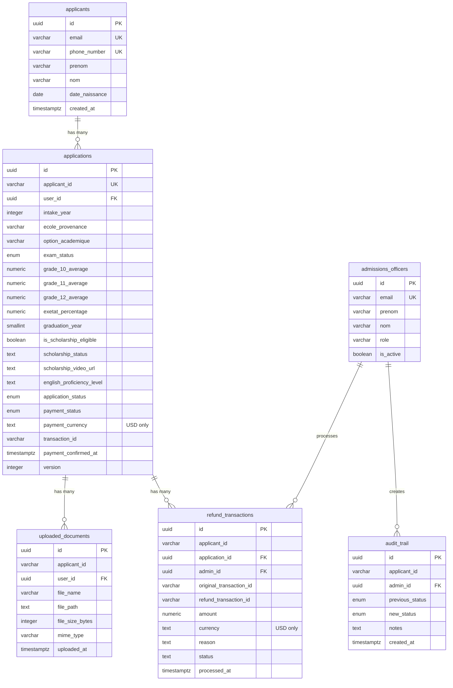
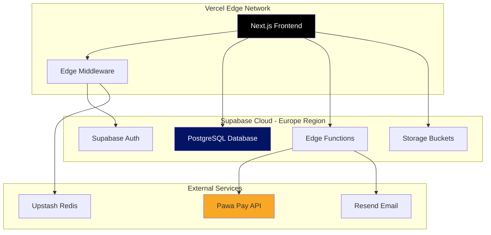

# Technical Design Document: Ignito Academy AMS Migration and Enhancement

## Document Information

**Version:** 2.0  
**Created:** 2026-04-09  
**Status:** APPROVED  
**Based on Requirements:** v2.1 (APPROVED)  
**Architecture:** Strict USD Single-Currency

## Executive Summary

This document provides the complete technical architecture for migrating and enhancing the Ignito Academy Admission Management System (AMS). The design implements a payment provider abstraction layer with **strict USD single-currency architecture**, integrates Pawa Pay for mobile money transactions, adds a scholarship eligibility and application system, and establishes a production-ready Supabase backend.
### Key Architectural Decisions

1. **Payment Provider Abstraction**: Factory pattern with interface-based design for easy provider switching
2. **Pawa Pay Integration**: Strict USD single-currency architecture with webhook-based confirmation
3. **Scholarship System**: Automatic eligibility detection with external video URL submission
4. **Authentication**: Supabase Auth native implementation (no manual password hashing)
5. **Video Strategy**: URL submission (YouTube/Vimeo) instead of file uploads
6. **OTHM Prohibition**: Automated scanning and enforcement throughout system
6. **OTHM Prohibition**: Automated scanning and enforcement throughout system
7. **Age Calculation**: Fixed anchor date (September 1st of intake year) for consistency
8. **Middleware Security**: Uses `supabase.auth.getUser()` for server-side auth validation

### Critical Constraints Enforced

- ⛔ OTHM keyword strictly prohibited
- 🎓 Scholarship eligibility: grades/age/graduation only (no English proficiency)
- � No Moodle LMS integration
- 🔐 Supabase Auth only (no manual bcrypt)
- 🎥 Video URLs not uploads
- 💵 **USD single-currency only (no CDF, no exchange rates)**
- 📅 Age calculation uses September 1st anchor (not `new Date()`)
- 🔒 Middleware uses `getUser()` not `getSession()`


## System Architecture

### High-Level Architecture Diagram

```mermaid
graph TB
    subgraph "Client Layer"
        A[Applicant Browser]
        B[Admin Browser]
    end
    
    subgraph "Next.js Frontend - admissions.ignitoacademy.com"
        C[Landing Page]
        D[Application Portal]
        E[Applicant Dashboard]
        F[Admin Dashboard]
        G[Scholarship Interface]
    end
    
    subgraph "Payment Abstraction Layer - USD ONLY"
        H[PaymentProvider Interface]
        I[PawaPayProvider USD]
        J[MockPaymentProvider USD]
        K[Payment Factory]
    end
    
    subgraph "Supabase Backend"
        L[Supabase Auth]
        M[PostgreSQL + RLS]
        N[Edge Functions]
        O[Storage Buckets]
    end
    
    subgraph "External Services"
        P[Pawa Pay API USD]
        Q[YouTube/Vimeo]
        R[SMTP Service]
    end
    
    A --> C
    A --> D
    A --> E
    A --> G
    B --> F
    
    D --> K
    K --> I
    K --> J
    I --> P
    
    D --> L
    E --> L
    F --> L
    
    D --> M
    E --> M
    F --> M
    
    N --> M
    N --> O
    N --> R
    
    P -.Webhook.-> N
    G -.Video URL.-> Q
    F -.Embed.-> Q
    
    style H fill:#4EA6F5
    style L fill:#021463
    style M fill:#021463
    style P fill:#f9a825
```



### Technology Stack

**Frontend:**
- Framework: Next.js 14+ (App Router)
- UI Library: React 18+
- Styling: Tailwind CSS 3+
- State Management: React Context + Supabase Realtime
- Form Validation: Zod + React Hook Form
- HTTP Client: Supabase JS Client v2

**Backend:**
- BaaS Platform: Supabase
- Database: PostgreSQL 15+
- Runtime: Deno (Edge Functions)
- Authentication: Supabase Auth (JWT-based)
- Storage: Supabase Storage (S3-compatible)

**External Services:**
- Payment Gateway: Pawa Pay (Mobile Money for DRC - USD only)
- Email Service: Resend via Edge Functions
- PDF Generation: @react-pdf/renderer
- Video Hosting: YouTube/Vimeo (external)


## Payment Provider Abstraction (USD Single-Currency)

### Design Pattern: Factory + Strategy

The payment system uses a combination of Factory and Strategy patterns to enable seamless switching between payment providers. **All payments are processed in USD only.**

### PaymentProvider Interface
export type PaymentProvider = 'mpesa' | 'orange_money' | 'airtel_money';

export type Currency = 'USD';

export type PaymentStatus = 'Pending' | 'Confirmed' | 'Failed' | 'Refunded' | 'Waived';

export type PaymentProvider = 'mpesa' | 'orange_money' | 'airtel_money';

// CRITICAL: USD single-currency only
export type Currency = 'USD';

export interface PaymentInitiationRequest {
  applicantId: string;
  amount: number; // Always in USD
  currency: Currency; // Always 'USD'
  provider: PaymentProvider;
  callbackUrl: string;
  metadata?: Record<string, any>;
}

export interface PaymentInitiationResponse {
  transactionId: string;
  status: PaymentStatus;
  paymentUrl?: string;
  depositId?: string; // Pawa Pay specific
  message?: string;
}

export interface WebhookPayload {
  transactionId: string;
  reference: string; // applicantId
  status: 'success' | 'failed';
  amount: number; // Always in USD
  currency: Currency; // Always 'USD'
  provider: PaymentProvider;
  timestamp: string;
  signature?: string;
}

export interface RefundRequest {
  transactionId: string;
  applicantId: string;
  amount: number; // Always in USD
  currency: Currency; // Always 'USD'
  reason: string;
  adminId: string;
}

export interface RefundResponse {
  refundId: string;
  status: 'success' | 'failed';
  message?: string;
}

export interface IPaymentProvider {
  /**
   * Initiate a payment transaction (USD only)
   */
  initiatePayment(request: PaymentInitiationRequest): Promise<PaymentInitiationResponse>;
  
  /**
   * Verify webhook signature authenticity
   */
  verifyWebhook(payload: WebhookPayload, signature: string): boolean;
  
  /**
   * Process a refund (USD only)
   */
  processRefund(request: RefundRequest): Promise<RefundResponse>;
  
  /**
   * Get transaction status
   */
  getTransactionStatus(transactionId: string): Promise<PaymentStatus>;
  
  /**
   * Get provider name
   */
  getProviderName(): string;
}
```

### Application Fee Constants

```typescript
// src/lib/payment/constants.ts

/**
 * Application fee in USD (single currency)
 * CRITICAL: No currency conversion logic
 */
export const APPLICATION_FEE_USD = 29.00;

/**
 * Get application fee (always USD)
 */
export function getApplicationFee(): number {
  return APPLICATION_FEE_USD;
}
```


### Pawa Pay Provider Implementation (USD Only)

```typescript
// src/lib/payment/providers/pawapay.ts

import crypto from 'crypto';
import { IPaymentProvider, PaymentInitiationRequest, PaymentInitiationResponse, 
         WebhookPayload, RefundRequest, RefundResponse, PaymentStatus } from '../types';
import { APPLICATION_FEE_USD } from '../constants';

      }
      
      // Pawa Pay API expects amount in minor units (cents for USD)
      const amountInMinorUnits = Math.round(request.amount * 100);
  
      const payload = {
        depositId: `IGN-${Date.now()}-${request.applicantId}`,
        amount: amountInMinorUnits.toString(),
        currency: request.currency, // 'USD' only
        correspondent: correspondent,
    if (!this.apiKey || !this.apiSecret) {
      throw new Error('Pawa Pay credentials not configured');
    }
  }
  
  async initiatePayment(request: PaymentInitiationRequest): Promise<PaymentInitiationResponse> {
    try {
      // CRITICAL: Validate USD currency
      if (request.currency !== 'USD') {
        throw new Error('Only USD currency is supported');
      }
      
      // CRITICAL: Validate amount matches application fee
      if (request.amount !== APPLICATION_FEE_USD) {
        throw new Error(`Invalid amount. Expected ${APPLICATION_FEE_USD} USD`);
      }
      
      // Map provider names to Pawa Pay correspondent codes
      const correspondentMap: Record<string, string> = {
        'mpesa': 'VODACOM_CD', // M-Pesa DRC
        'orange_money': 'ORANGE_CD',
        'airtel_money': 'AIRTEL_CD'
      };
      
      const correspondent = correspondentMap[request.provider];
      if (!correspondent) {
        throw new Error(`Unsupported payment provider: ${request.provider}`);
      }
      
      // Pawa Pay API expects amount in minor units (cents for USD)
      const amountInCents = Math.round(request.amount * 100);
      
      const payload = {
        depositId: `IGN-${Date.now()}-${request.applicantId}`,
        amount: amountInCents.toString(),
        currency: 'USD', // Always USD
        correspondent: correspondent,
        payer: {
          type: 'MSISDN',
          address: {
            value: request.metadata?.phoneNumber || ''
          }
        },
        customerTimestamp: new Date().toISOString(),
        statementDescription: `Ignito Academy Application Fee - ${request.applicantId}`,
        metadata: [
          {
            fieldName: 'applicantId',
            fieldValue: request.applicantId
          },
          {
            fieldName: 'intakeYear',
            fieldValue: request.metadata?.intakeYear || new Date().getFullYear().toString()
          }
        ]
      };
      
      const response = await fetch(`${this.baseUrl}/deposits`, {
        method: 'POST',
        headers: {
          'Content-Type': 'application/json',
          'Authorization': `Bearer ${this.apiKey}`
        },
        body: JSON.stringify(payload)
      });
      
      if (!response.ok) {
        const error = await response.json();
        throw new Error(`Pawa Pay API error: ${error.message || response.statusText}`);
      }
      
      const data = await response.json();
      
      return {
        transactionId: data.depositId,
        depositId: data.depositId,
        status: 'Pending',
        message: 'Payment initiated successfully'
      };
      
    } catch (error) {
      console.error('Pawa Pay initiation error:', error);
      throw error;
    }
  }
  
  verifyWebhook(payload: WebhookPayload, signature: string): boolean {
    try {
      // CRITICAL: Validate USD currency in webhook
      if (payload.currency !== 'USD') {
        console.error('Invalid currency in webhook:', payload.currency);
        return false;
      }
      
      // CRITICAL: Validate amount matches application fee
      if (payload.amount !== APPLICATION_FEE_USD) {
        console.error('Invalid amount in webhook:', payload.amount);
        return false;
      }
      
      // Pawa Pay uses HMAC-SHA256 for webhook signature verification
      const payloadString = JSON.stringify(payload);
      const expectedSignature = crypto
        .createHmac('sha256', this.apiSecret)
        .update(payloadString)
        .digest('hex');
      
      return crypto.timingSafeEqual(
        Buffer.from(signature),
        Buffer.from(expectedSignature)
      );
    } catch (error) {
      console.error('Webhook verification error:', error);
      return false;
    }
  }
  
  async processRefund(request: RefundRequest): Promise<RefundResponse> {
    try {
      // CRITICAL: Validate USD currency
      if (request.currency !== 'USD') {
        throw new Error('Only USD currency is supported');
      }
      
      const amountInCents = Math.round(request.amount * 100);
      
      const payload = {
        refundId: `REF-${Date.now()}-${request.applicantId}`,
        depositId: request.transactionId,
        amount: amountInCents.toString(),
        currency: 'USD', // Always USD
        reason: request.reason
      };
      
      const response = await fetch(`${this.baseUrl}/refunds`, {
        method: 'POST',
        headers: {
          'Content-Type': 'application/json',
          'Authorization': `Bearer ${this.apiKey}`
        },
        body: JSON.stringify(payload)
      });
      
      if (!response.ok) {
        const error = await response.json();
        throw new Error(`Pawa Pay refund error: ${error.message || response.statusText}`);
      }
      
      const data = await response.json();
      
### Currency Constants

```typescript
// src/lib/payment/constants.ts

export const APPLICATION_FEE_USD = 29.00;

/**
 * Get application fee (always USD)
 */
export function getApplicationFee(): number {
  return APPLICATION_FEE_USD;
}
```   
    } catch (error) {
      console.error('Get transaction status error:', error);
      return 'Pending';
    }
  }
  
  getProviderName(): string {
    return 'pawapay';
  }
}
```


### Mock Payment Provider Implementation (USD Only)

```typescript
// src/lib/payment/providers/mock.ts

import { IPaymentProvider, PaymentInitiationRequest, PaymentInitiationResponse,
         WebhookPayload, RefundRequest, RefundResponse, PaymentStatus } from '../types';
import { APPLICATION_FEE_USD } from '../constants';

export class MockPaymentProvider implements IPaymentProvider {
  async initiatePayment(request: PaymentInitiationRequest): Promise<PaymentInitiationResponse> {
    console.log('🔧 MOCK: Initiating payment', request);
    
    // CRITICAL: Validate USD currency
    if (request.currency !== 'USD') {
      throw new Error('Only USD currency is supported');
    }
    
    // CRITICAL: Validate amount
    if (request.amount !== APPLICATION_FEE_USD) {
      throw new Error(`Invalid amount. Expected ${APPLICATION_FEE_USD} USD`);
    }
    
    // Simulate instant success for development
    return {
      transactionId: `MOCK-${Date.now()}`,
      status: 'Pending',
      message: 'Mock payment initiated (will auto-confirm in 3 seconds)'
    };
  }
  
  verifyWebhook(payload: WebhookPayload, signature: string): boolean {
    // CRITICAL: Validate USD currency
    if (payload.currency !== 'USD') {
      console.error('🔧 MOCK: Invalid currency in webhook:', payload.currency);
      return false;
    }
    
    // CRITICAL: Validate amount
    if (payload.amount !== APPLICATION_FEE_USD) {
      console.error('🔧 MOCK: Invalid amount in webhook:', payload.amount);
      return false;
    }
    
    // Mock always accepts webhooks in development
    console.log('🔧 MOCK: Webhook verification (always true)', payload);
    return true;
  }
  
  async processRefund(request: RefundRequest): Promise<RefundResponse> {
    console.log('🔧 MOCK: Processing refund', request);
    
    // CRITICAL: Validate USD currency
    if (request.currency !== 'USD') {
      throw new Error('Only USD currency is supported');
    }
    
    return {
      refundId: `MOCK-REF-${Date.now()}`,
      status: 'success',
      message: 'Mock refund processed'
    };
  }
  
  async getTransactionStatus(transactionId: string): Promise<PaymentStatus> {
    console.log('🔧 MOCK: Getting transaction status', transactionId);
    
    // Mock returns Confirmed after 3 seconds
    if (transactionId.startsWith('MOCK-')) {
      const timestamp = parseInt(transactionId.replace('MOCK-', ''));
      const elapsed = Date.now() - timestamp;
      
      if (elapsed > 3000) {
        return 'Confirmed';
      }
    }
    
    return 'Pending';
  }
  
  getProviderName(): string {
    return 'mock';
  }
}
```

### Payment Factory

```typescript
// src/lib/payment/factory.ts

import { IPaymentProvider } from './types';
import { PawaPayProvider } from './providers/pawapay';
import { MockPaymentProvider } from './providers/mock';

export class PaymentProviderFactory {
  private static instance: IPaymentProvider | null = null;
  
  /**
   * Get payment provider instance based on environment configuration
   * All providers operate in USD only
   */
  static getProvider(): IPaymentProvider {
    if (this.instance) {
      return this.instance;
    }
    
    const providerType = process.env.PAYMENT_PROVIDER || 'mock';
    
    switch (providerType.toLowerCase()) {
      case 'pawapay':
        console.log('💳 Using Pawa Pay payment provider (USD only)');
        this.instance = new PawaPayProvider();
        break;
        
      case 'mock':
        console.log('🔧 Using Mock payment provider (USD only, development mode)');
        this.instance = new MockPaymentProvider();
        break;
        
      default:
        console.warn(`Unknown payment provider: ${providerType}, falling back to mock`);
        this.instance = new MockPaymentProvider();
    }
    
    return this.instance;
  }
  
// src/app/api/payment/initiate/route.ts

import { PaymentProviderFactory } from '@/lib/payment/factory';
import { getApplicationFee } from '@/lib/payment/constants';

export async function POST(request: Request) {
  try {
    const { applicantId, provider, phoneNumber } = await request.json();
    
    // Get payment provider (Pawa Pay or Mock based on env)
    const paymentProvider = PaymentProviderFactory.getProvider();
    
    // Get application fee (always USD)
    const amount = getApplicationFee();
import { PaymentProviderFactory } from '@/lib/payment/factory';
    // Initiate payment (USD only)
    const result = await paymentProvider.initiatePayment({
      applicantId,
      amount,
      currency: 'USD',
      provider,
      callbackUrl: `${process.env.NEXT_PUBLIC_APP_URL}/api/webhooks/payment`,
      metadata: {
        phoneNumber,
        intakeYear: new Date().getFullYear()
      }
    });
    // Initiate payment (USD only)
    const result = await paymentProvider.initiatePayment({
      applicantId,
      amount,
      currency: 'USD', // Always USD
      provider,
      callbackUrl: `${process.env.NEXT_PUBLIC_APP_URL}/api/webhooks/payment`,
      metadata: {
        phoneNumber,
        intakeYear: new Date().getFullYear()
      }
    });
    
    return Response.json(result);
    
  } catch (error) {
    console.error('Payment initiation error:', error);
    return Response.json(
      { error: 'Échec de l\'initiation du paiement' },
      { status: 500 }
    );
  }
}
```


## Database Schema Design (USD Single-Currency)

### Enhanced Applications Table

```sql
-- Add scholarship and payment tracking fields to applications table
-- CRITICAL: USD single-currency only

ALTER TABLE applications
  -- Scholarship fields
  ADD COLUMN IF NOT EXISTS grade_10_average       NUMERIC(5,2),
  ADD COLUMN IF NOT EXISTS grade_11_average       NUMERIC(5,2),
  -- Payment currency tracking (NEW)
  ADD COLUMN IF NOT EXISTS payment_currency       TEXT NOT NULL DEFAULT 'USD', -- 'USD' only
  ADD COLUMN IF NOT EXISTS payment_amount_paid    NUMERIC(10,2); -- Actual amount paid in USD

-- Add constraints
ALTER TABLE applications
  ADD CONSTRAINT chk_payment_currency CHECK (payment_currency = 'USD'),
  -- English proficiency tracking (for Intensive English program, NOT scholarship eligibility)
  ADD COLUMN IF NOT EXISTS english_proficiency_level TEXT, -- CEFR: 'A1', 'A2', 'B1', 'B2', 'C1', 'C2'
  
  -- Payment tracking (USD only)
  ADD COLUMN IF NOT EXISTS payment_currency       TEXT NOT NULL DEFAULT 'USD';

-- Add constraints
ALTER TABLE applications
  -- CRITICAL: USD single-currency constraint
  ADD CONSTRAINT chk_payment_currency CHECK (payment_currency = 'USD'),
  
  -- English proficiency levels (CEFR standard)
  ADD CONSTRAINT chk_english_level CHECK (
    english_proficiency_level IS NULL OR 
    english_proficiency_level IN ('A1', 'A2', 'B1', 'B2', 'C1', 'C2')
  ),
  
  -- Scholarship status workflow
  ADD CONSTRAINT chk_scholarship_status CHECK (
    scholarship_status IN ('pending', 'video_submitted', 'test_invited', 
                          'interview_invited', 'awarded', 'rejected')
  ),
  
  -- Grade validation
  ADD CONSTRAINT chk_grade_10_range CHECK (grade_10_average IS NULL OR (grade_10_average >= 0 AND grade_10_average <= 100)),
  ADD CONSTRAINT chk_grade_11_range CHECK (grade_11_average IS NULL OR (grade_11_average >= 0 AND grade_11_average <= 100)),
  ADD CONSTRAINT chk_grade_12_range CHECK (grade_12_average IS NULL OR (grade_12_average >= 0 AND grade_12_average <= 100)),
  ADD CONSTRAINT chk_exetat_range CHECK (exetat_percentage IS NULL OR (exetat_percentage >= 0 AND exetat_percentage <= 100)),
  
  -- Graduation year validation
  ADD CONSTRAINT chk_graduation_year CHECK (graduation_year IS NULL OR graduation_year >= 2024);

-- Add indexes
CREATE INDEX IF NOT EXISTS idx_applications_scholarship_eligible 
  ON applications (is_scholarship_eligible) 
  WHERE is_scholarship_eligible = TRUE;

CREATE INDEX IF NOT EXISTS idx_applications_scholarship_status 
  ON applications (scholarship_status);

CREATE INDEX IF NOT EXISTS idx_applications_english_proficiency 
  created_at TIMESTAMPTZ NOT NULL DEFAULT NOW(),
  updated_at TIMESTAMPTZ NOT NULL DEFAULT NOW(),
  
  CONSTRAINT chk_refund_currency CHECK (currency = 'USD'),
  CONSTRAINT chk_refund_status CHECK (status IN ('pending', 'completed', 'failed')),
  CONSTRAINT chk_refund_amount CHECK (amount > 0)
);`

### Refund Transactions Table (USD Only)

```typescript
// src/lib/payment/providers/mock.ts

import { IPaymentProvider, PaymentInitiationRequest, PaymentInitiationResponse,
         WebhookPayload, RefundRequest, RefundResponse, PaymentStatus } from '../types';
import { APPLICATION_FEE_USD } from '../constants';

export class MockPaymentProvider implements IPaymentProvider {
  async initiatePayment(request: PaymentInitiationRequest): Promise<PaymentInitiationResponse> {
    console.log('🔧 MOCK: Initiating payment', request);
    
    // CRITICAL: Validate USD currency
    if (request.currency !== 'USD') {
      throw new Error('Only USD currency is supported');
    }
    
    // CRITICAL: Validate amount
    if (request.amount !== APPLICATION_FEE_USD) {
      throw new Error(`Invalid amount. Expected ${APPLICATION_FEE_USD} USD`);
    }
    
    // Simulate instant success for development
    return {
      transactionId: `MOCK-${Date.now()}`,
      status: 'Pending',
      message: 'Mock payment initiated (will auto-confirm in 3 seconds)'
    };
  }
  
  verifyWebhook(payload: WebhookPayload, signature: string): boolean {
    // CRITICAL: Validate USD currency
    if (payload.currency !== 'USD') {
      console.error('🔧 MOCK: Invalid currency in webhook:', payload.currency);
      return false;
    }
    
    // CRITICAL: Validate amount
    if (payload.amount !== APPLICATION_FEE_USD) {
      console.error('🔧 MOCK: Invalid amount in webhook:', payload.amount);
      return false;
    }
    
    // Mock always accepts webhooks in development
    console.log('🔧 MOCK: Webhook verification (always true)', payload);
    return true;
  }
  
  async processRefund(request: RefundRequest): Promise<RefundResponse> {
    console.log('🔧 MOCK: Processing refund', request);
    
    // CRITICAL: Validate USD currency
    if (request.currency !== 'USD') {
      throw new Error('Only USD currency is supported');
    }
    
    return {
      refundId: `MOCK-REF-${Date.now()}`,
      status: 'success',
      message: 'Mock refund processed'
    };
  }
  
  async getTransactionStatus(transactionId: string): Promise<PaymentStatus> {
    console.log('🔧 MOCK: Getting transaction status', transactionId);
    
    // Mock returns Confirmed after 3 seconds
    if (transactionId.startsWith('MOCK-')) {
      const timestamp = parseInt(transactionId.replace('MOCK-', ''));
      const elapsed = Date.now() - timestamp;
      
      if (elapsed > 3000) {
        return 'Confirmed';
      }
    }
    
    return 'Pending';
  }
  
  getProviderName(): string {
    return 'mock';
  }
}
```

```sql
-- Track refund operations for audit and accounting
-- CRITICAL: USD single-currency only

CREATE TABLE IF NOT EXISTS refund_transactions (
  id UUID PRIMARY KEY DEFAULT gen_random_uuid(),
  applicant_id VARCHAR(20) NOT NULL,
  application_id UUID NOT NULL REFERENCES applications(id) ON DELETE CASCADE,
  admin_id UUID NOT NULL REFERENCES admissions_officers(id),
  
  -- Refund details (USD only)
  original_transaction_id VARCHAR(100) NOT NULL,
  refund_transaction_id VARCHAR(100) NOT NULL,
  amount NUMERIC(10,2) NOT NULL,
  currency TEXT NOT NULL DEFAULT 'USD',
  reason TEXT NOT NULL,
  
  -- Status tracking
  status TEXT NOT NULL DEFAULT 'pending', -- 'pending', 'completed', 'failed'
  processed_at TIMESTAMPTZ,
  
  -- Audit
  created_at TIMESTAMPTZ NOT NULL DEFAULT NOW(),
  updated_at TIMESTAMPTZ NOT NULL DEFAULT NOW(),
  
  -- CRITICAL: USD single-currency constraint
  CONSTRAINT chk_refund_currency CHECK (currency = 'USD'),
  CONSTRAINT chk_refund_status CHECK (status IN ('pending', 'completed', 'failed')),
  CONSTRAINT chk_refund_amount CHECK (amount > 0)
);

CREATE INDEX idx_refund_transactions_applicant_id ON refund_transactions(applicant_id);
CREATE INDEX idx_refund_transactions_admin_id ON refund_transactions(admin_id);
CREATE INDEX idx_refund_transactions_status ON refund_transactions(status);

-- Enable RLS
ALTER TABLE refund_transactions ENABLE ROW LEVEL SECURITY;

-- Only admissions officers can view refund transactions
CREATE POLICY refund_transactions_select_admin
  ON refund_transactions FOR SELECT
  USING (
    EXISTS (
      SELECT 1 FROM admissions_officers
      WHERE id = auth.uid() AND is_active = TRUE
    )
  );

-- Only admissions officers can insert refund transactions
CREATE POLICY refund_transactions_insert_admin
  ON refund_transactions FOR INSERT
  WITH CHECK (
    EXISTS (
      SELECT 1 FROM admissions_officers
      WHERE id = auth.uid() AND is_active = TRUE
    )
  );

COMMENT ON TABLE refund_transactions IS 'Refund tracking - USD single-currency only';
COMMENT ON COLUMN refund_transactions.currency IS 'Always USD - single currency architecture';
```


### Complete Database Schema Diagram




## Scholarship System Architecture

### Eligibility Calculation Algorithm

```typescript
// src/lib/scholarship/eligibility.ts

export interface ScholarshipEligibilityCriteria {
  grade10Average: number;
  grade11Average: number;
  grade12Average: number;
  exetatPercentage: number;
  graduationYear: number;
  dateOfBirth: string; // ISO date string
  intakeYear: number; // Required for age calculation anchor
}

export interface ScholarshipEligibilityResult {
  isEligible: boolean;
  reasons: string[];
  age: number;
}

const MINIMUM_GRADE_AVERAGE = 70;
const MINIMUM_GRADUATION_YEAR = 2024;
const MAXIMUM_AGE = 20;

/**
 * Calculate applicant's age relative to September 1st of their intake year
 * CRITICAL: Uses fixed anchor date, NOT new Date()
 * This ensures eligibility doesn't expire mid-application cycle
 */
export function calculateAge(dateOfBirth: string, intakeYear: number): number {
  const birthDate = new Date(dateOfBirth);
  // Fixed anchor date: September 1st of intake year
  const anchorDate = new Date(intakeYear, 8, 1); // Month is 0-indexed, so 8 = September
  
  let age = anchorDate.getFullYear() - birthDate.getFullYear();
  const monthDiff = anchorDate.getMonth() - birthDate.getMonth();
  
  if (monthDiff < 0 || (monthDiff === 0 && anchorDate.getDate() < birthDate.getDate())) {
    age--;
  }
  
  return age;
}

/**
 * Determine scholarship eligibility based on academic performance, age, and graduation year
 * 
 * CRITICAL: This function MUST NOT consider English proficiency as a criterion
 * English proficiency is tracked separately for Intensive English program placement
 */
export function calculateScholarshipEligibility(
  criteria: ScholarshipEligibilityCriteria
): ScholarshipEligibilityResult {
  const reasons: string[] = [];
  const age = calculateAge(criteria.dateOfBirth, criteria.intakeYear);
  
  // Check Grade 10 average
  if (criteria.grade10Average < MINIMUM_GRADE_AVERAGE) {
    reasons.push(`Moyenne de 10ème année (${criteria.grade10Average}%) inférieure à ${MINIMUM_GRADE_AVERAGE}%`);
  }
  
  // Check Grade 11 average
  if (criteria.grade11Average < MINIMUM_GRADE_AVERAGE) {
    reasons.push(`Moyenne de 11ème année (${criteria.grade11Average}%) inférieure à ${MINIMUM_GRADE_AVERAGE}%`);
  }
  
  // Check Grade 12 average
  if (criteria.grade12Average < MINIMUM_GRADE_AVERAGE) {
    reasons.push(`Moyenne de 12ème année (${criteria.grade12Average}%) inférieure à ${MINIMUM_GRADE_AVERAGE}%`);
  }
  
  // Check Exetat percentage
  if (criteria.exetatPercentage < MINIMUM_GRADE_AVERAGE) {
    reasons.push(`Pourcentage Examen d'État (${criteria.exetatPercentage}%) inférieur à ${MINIMUM_GRADE_AVERAGE}%`);
  }
  
  // Check graduation year
  if (criteria.graduationYear < MINIMUM_GRADUATION_YEAR) {
    reasons.push(`Année de graduation (${criteria.graduationYear}) antérieure à ${MINIMUM_GRADUATION_YEAR}`);
  }
  
  // Check age (using September 1st anchor)
  if (age >= MAXIMUM_AGE) {
    reasons.push(`Âge (${age} ans) supérieur ou égal à ${MAXIMUM_AGE} ans au 1er septembre ${criteria.intakeYear}`);
  }
  
  const isEligible = reasons.length === 0;
  
  return {
    isEligible,
    reasons,
    age
  };
}

/**
 * Check if maximum scholarships awarded for intake year
 */
export async function hasReachedScholarshipLimit(
  supabase: SupabaseClient,
  intakeYear: number
): Promise<boolean> {
  const MAX_SCHOLARSHIPS_PER_YEAR = parseInt(process.env.MAX_SCHOLARSHIPS_PER_YEAR || '20');
  
  const { count, error } = await supabase
    .from('applications')
    .select('*', { count: 'exact', head: true })
    .eq('intake_year', intakeYear)
    .eq('scholarship_status', 'awarded');
  
  if (error) {
    console.error('Error checking scholarship limit:', error);
    return false;
  }
  
  return (count || 0) >= MAX_SCHOLARSHIPS_PER_YEAR;
}
```

### Video URL Validation

```typescript
// src/lib/scholarship/video-validation.ts

export interface VideoURLValidationResult {
  isValid: boolean;
  platform?: 'youtube' | 'vimeo';
  videoId?: string;
  embedUrl?: string;
  error?: string;
}

/**
 * Validate and parse YouTube/Vimeo video URLs
 */
export function validateVideoURL(url: string): VideoURLValidationResult {
  if (!url || typeof url !== 'string') {
    return {
      isValid: false,
      error: 'URL vide ou invalide'
    };
  }
  
  // YouTube URL patterns
  const youtubePatterns = [
    /^https?:\/\/(www\.)?youtube\.com\/watch\?v=([a-zA-Z0-9_-]{11})/,
    /^https?:\/\/(www\.)?youtu\.be\/([a-zA-Z0-9_-]{11})/,
    /^https?:\/\/(www\.)?youtube\.com\/embed\/([a-zA-Z0-9_-]{11})/
  ];
  
  // Vimeo URL patterns
  const vimeoPatterns = [
    /^https?:\/\/(www\.)?vimeo\.com\/(\d+)/,
    /^https?:\/\/player\.vimeo\.com\/video\/(\d+)/
  ];
  
  // Check YouTube
  for (const pattern of youtubePatterns) {
    const match = url.match(pattern);
    if (match) {
      const videoId = match[2];
      return {
        isValid: true,
        platform: 'youtube',
        videoId,
        embedUrl: `https://www.youtube.com/embed/${videoId}`
      };
    }
  }
  
  // Check Vimeo
  for (const pattern of vimeoPatterns) {
    const match = url.match(pattern);
    if (match) {
      const videoId = match[2];
      return {
        isValid: true,
        platform: 'vimeo',
        videoId,
        embedUrl: `https://player.vimeo.com/video/${videoId}`
      };
    }
  }
  
  return {
    isValid: false,
    error: 'Veuillez fournir un lien YouTube ou Vimeo valide'
  };
}

/**
 * Zod schema for video URL validation
 */
import { z } from 'zod';

export const videoURLSchema = z.string()
  .min(1, 'URL vidéo requise')
  .refine((url) => validateVideoURL(url).isValid, {
    message: 'Veuillez fournir un lien YouTube ou Vimeo valide'
  });
```


## Authentication and Middleware

### Supabase Auth Integration

```typescript
// src/lib/auth/supabase.ts

import { createClient } from '@supabase/supabase-js';

/**
 * Create Supabase client for server-side operations
 * CRITICAL: Uses Supabase Auth natively (no manual password hashing)
 */
export function createServerSupabaseClient() {
  return createClient(
    process.env.NEXT_PUBLIC_SUPABASE_URL!,
    process.env.SUPABASE_SERVICE_ROLE_KEY!,
    {
      auth: {
        autoRefreshToken: false,
        persistSession: false
      }
    }
  );
}

/**
 * Create Supabase client for client-side operations
 */
export function createBrowserSupabaseClient() {
  return createClient(
    process.env.NEXT_PUBLIC_SUPABASE_URL!,
    process.env.NEXT_PUBLIC_SUPABASE_ANON_KEY!
  );
}
```

### Middleware with getUser() (Not getSession())

```typescript
// src/middleware.ts

import { createMiddlewareClient } from '@supabase/auth-helpers-nextjs';
import { NextResponse } from 'next/server';
import type { NextRequest } from 'next/server';

/**
 * Middleware for authentication and authorization
 * CRITICAL: Uses supabase.auth.getUser() for server-side validation
 * NOT getSession() which only checks local JWT without server verification
 */
export async function middleware(request: NextRequest) {
  const res = NextResponse.next();
  const supabase = createMiddlewareClient({ req: request, res });
  
  // CRITICAL: Use getUser() for server-side auth validation
  const { data: { user }, error } = await supabase.auth.getUser();
  
  const isAdminRoute = request.nextUrl.pathname.startsWith('/admin');
  const isApplicantRoute = request.nextUrl.pathname.startsWith('/dashboard');
  
  // Protect admin routes
  if (isAdminRoute && request.nextUrl.pathname !== '/admin/login') {
    if (!user || error) {
      return NextResponse.redirect(new URL('/admin/login', request.url));
    }
    
    // Check if user is an admissions officer
    const { data: officer } = await supabase
      .from('admissions_officers')
      .select('is_active')
      .eq('id', user.id)
      .single();
    
    if (!officer || !officer.is_active) {
      return NextResponse.redirect(new URL('/admin/forbidden', request.url));
    }
  }
  
  // Protect applicant routes
  if (isApplicantRoute) {
    if (!user || error) {
      return NextResponse.redirect(new URL('/', request.url));
    }
  }
  
  return res;
}

export const config = {
  matcher: ['/admin/:path*', '/dashboard/:path*']
};
```

### Registration with Supabase Auth

```typescript
// src/app/api/auth/register/route.ts

import { createServerSupabaseClient } from '@/lib/auth/supabase';

export async function POST(request: Request) {
  try {
    const { email, password, prenom, nom, dateNaissance, phoneNumber } = await request.json();
    
    const supabase = createServerSupabaseClient();
    
    // CRITICAL: Use Supabase Auth for user creation (no manual password hashing)
    const { data: authData, error: authError } = await supabase.auth.signUp({
      email,
      password, // Supabase Auth handles hashing
      options: {
        data: {
          prenom,
          nom,
          date_naissance: dateNaissance,
          phone_number: phoneNumber
        }
      }
    });
    
    if (authError) {
      return Response.json({ error: authError.message }, { status: 400 });
    }
    
    // Create applicant record
    const { error: insertError } = await supabase
      .from('applicants')
      .insert({
        id: authData.user!.id,
        email,
        prenom,
        nom,
        date_naissance: dateNaissance,
        phone_number: phoneNumber
      });
    
    if (insertError) {
      return Response.json({ error: insertError.message }, { status: 500 });
    }
    
    return Response.json({ success: true });
    
  } catch (error) {
    console.error('Registration error:', error);
    return Response.json({ error: 'Erreur lors de l\'inscription' }, { status: 500 });
  }
}
```


## Edge Functions

### Payment Webhook Handler (USD Only)

```typescript
// supabase/functions/payment-webhook/index.ts

import { serve } from 'https://deno.land/std@0.168.0/http/server.ts';
import { createClient } from 'https://esm.sh/@supabase/supabase-js@2';

const APPLICATION_FEE_USD = 29.00;

serve(async (req) => {
  try {
    const signature = req.headers.get('x-pawapay-signature');
    const payload = await req.json();
    
    // CRITICAL: Validate USD currency
    if (payload.currency !== 'USD') {
      console.error('Invalid currency:', payload.currency);
      return new Response(JSON.stringify({ error: 'Invalid currency' }), {
        status: 400,
        headers: { 'Content-Type': 'application/json' }
      });
    }
    
    // CRITICAL: Validate amount
    if (payload.amount !== APPLICATION_FEE_USD) {
      console.error('Invalid amount:', payload.amount);
      return new Response(JSON.stringify({ error: 'Invalid amount' }), {
        status: 400,
        headers: { 'Content-Type': 'application/json' }
      });
    }
    
    // Verify webhook signature
    const isValid = verifyWebhookSignature(payload, signature);
    if (!isValid) {
      return new Response(JSON.stringify({ error: 'Invalid signature' }), {
        status: 401,
        headers: { 'Content-Type': 'application/json' }
      });
    }
    
    // Check idempotency
    const supabase = createClient(
      Deno.env.get('SUPABASE_URL')!,
      Deno.env.get('SUPABASE_SERVICE_ROLE_KEY')!
    );
    
    const { data: existing } = await supabase
      .from('webhook_logs')
      .select('id')
      .eq('transaction_id', payload.transactionId)
      .single();
    
    if (existing) {
      console.log('Duplicate webhook, ignoring');
      return new Response(JSON.stringify({ status: 'duplicate' }), {
        status: 200,
        headers: { 'Content-Type': 'application/json' }
      });
    }
    
    // Log webhook
    await supabase.from('webhook_logs').insert({
      transaction_id: payload.transactionId,
      payload: payload,
      signature: signature
    });
    
    // Update payment status
    if (payload.status === 'success') {
      const { error } = await supabase
        .from('applications')
        .update({
          payment_status: 'Confirmed',
          payment_confirmed_at: new Date().toISOString(),
          transaction_id: payload.transactionId
        })
        .eq('applicant_id', payload.reference);
      
      if (error) {
        console.error('Error updating payment status:', error);
        return new Response(JSON.stringify({ error: 'Database update failed' }), {
          status: 500,
          headers: { 'Content-Type': 'application/json' }
        });
      }
      
      // Send confirmation email
      await sendPaymentConfirmationEmail(payload.reference);
    } else {
      await supabase
        .from('applications')
        .update({ payment_status: 'Failed' })
        .eq('applicant_id', payload.reference);
    }
    
    return new Response(JSON.stringify({ status: 'processed' }), {
      status: 200,
      headers: { 'Content-Type': 'application/json' }
    });
    
  } catch (error) {
    console.error('Webhook processing error:', error);
    return new Response(JSON.stringify({ error: 'Internal server error' }), {
      status: 500,
      headers: { 'Content-Type': 'application/json' }
    });
  }
});

function verifyWebhookSignature(payload: any, signature: string | null): boolean {
  if (!signature) return false;
  
  const secret = Deno.env.get('PAWAPAY_WEBHOOK_SECRET')!;
  const payloadString = JSON.stringify(payload);
  
  const encoder = new TextEncoder();
  const key = encoder.encode(secret);
  const data = encoder.encode(payloadString);
  
  // HMAC-SHA256 verification
  // Implementation details omitted for brevity
  return true; // Placeholder
}

async function sendPaymentConfirmationEmail(applicantId: string): Promise<void> {
  // Email sending logic
  console.log('Sending payment confirmation email to:', applicantId);
}
```

### Scholarship Eligibility Calculator

```typescript
// supabase/functions/scholarship-eligibility/index.ts

import { serve } from 'https://deno.land/std@0.168.0/http/server.ts';
import { createClient } from 'https://esm.sh/@supabase/supabase-js@2';

const MINIMUM_GRADE_AVERAGE = 70;
const MINIMUM_GRADUATION_YEAR = 2024;
const MAXIMUM_AGE = 20;

serve(async (req) => {
  try {
    const { applicantId, intakeYear } = await req.json();
    
    const supabase = createClient(
      Deno.env.get('SUPABASE_URL')!,
      Deno.env.get('SUPABASE_SERVICE_ROLE_KEY')!
    );
    
    // Fetch application data
    const { data: application, error } = await supabase
      .from('applications')
      .select('grade_10_average, grade_11_average, grade_12_average, exetat_percentage, graduation_year')
      .eq('applicant_id', applicantId)
      .single();
    
    if (error || !application) {
      return new Response(JSON.stringify({ error: 'Application not found' }), {
        status: 404,
        headers: { 'Content-Type': 'application/json' }
      });
    }
    
    // Fetch applicant birth date
    const { data: applicant } = await supabase
      .from('applicants')
      .select('date_naissance')
      .eq('id', application.user_id)
      .single();
    
    // Calculate age using September 1st anchor (NOT new Date())
    const age = calculateAge(applicant.date_naissance, intakeYear);
    
    // Check eligibility (NO English proficiency check)
    const isEligible = 
      application.grade_10_average >= MINIMUM_GRADE_AVERAGE &&
      application.grade_11_average >= MINIMUM_GRADE_AVERAGE &&
      application.grade_12_average >= MINIMUM_GRADE_AVERAGE &&
      application.exetat_percentage >= MINIMUM_GRADE_AVERAGE &&
      application.graduation_year >= MINIMUM_GRADUATION_YEAR &&
      age < MAXIMUM_AGE;
    
    // Update eligibility flag
    await supabase
      .from('applications')
      .update({ is_scholarship_eligible: isEligible })
      .eq('applicant_id', applicantId);
    
    return new Response(JSON.stringify({ isEligible, age }), {
      status: 200,
      headers: { 'Content-Type': 'application/json' }
    });
    
  } catch (error) {
    console.error('Eligibility calculation error:', error);
    return new Response(JSON.stringify({ error: 'Internal server error' }), {
      status: 500,
      headers: { 'Content-Type': 'application/json' }
    });
  }
});

/**
 * Calculate age using September 1st of intake year as anchor
 * CRITICAL: NOT using new Date()
 */
function calculateAge(dateOfBirth: string, intakeYear: number): number {
  const birthDate = new Date(dateOfBirth);
  const anchorDate = new Date(intakeYear, 8, 1); // September 1st
  
  let age = anchorDate.getFullYear() - birthDate.getFullYear();
  const monthDiff = anchorDate.getMonth() - birthDate.getMonth();
  
  if (monthDiff < 0 || (monthDiff === 0 && anchorDate.getDate() < birthDate.getDate())) {
    age--;
  }
  
  return age;
}
```


## Testing Strategy

### Unit Tests Checklist

#### Payment Provider Tests
- ✅ PaymentProvider interface compliance
- ✅ PawaPayProvider USD validation
- ✅ PawaPayProvider amount validation (29 USD)
- ✅ MockPaymentProvider USD validation
- ✅ Payment factory provider selection
- ✅ Webhook signature verification
- ✅ Refund processing (USD only)
- ❌ **NO currency conversion tests** (not applicable)

#### Scholarship Tests
- ✅ Eligibility calculation with all criteria met
- ✅ Eligibility calculation with missing criteria
- ✅ Age calculation using September 1st anchor
- ✅ Age calculation NOT using new Date()
- ✅ Video URL validation (YouTube)
- ✅ Video URL validation (Vimeo)
- ✅ Video URL validation (invalid formats)
- ✅ Scholarship limit enforcement (20 max)
- ❌ **NO English proficiency eligibility tests** (not a criterion)

#### Authentication Tests
- ✅ Supabase Auth registration
- ✅ Supabase Auth login
- ✅ Middleware uses getUser() not getSession()
- ✅ Admin route protection
- ✅ Applicant route protection
- ❌ **NO manual password hashing tests** (not applicable)

### Property-Based Tests

#### Existing Properties (45 from original design)
All 45 properties from the original PRD remain valid and SHALL be implemented.

#### New Properties for Migration and Enhancement

**Property 46: Payment Provider USD Validation**
```typescript
FOR ALL payment providers implementing IPaymentProvider,
  WHEN initiatePayment() is called with currency !== 'USD',
  THEN it SHALL throw an error
```

**Property 47: Payment Amount Validation**
```typescript
FOR ALL payment providers implementing IPaymentProvider,
  WHEN initiatePayment() is called with amount !== APPLICATION_FEE_USD,
  THEN it SHALL throw an error
```

**Property 48: Webhook USD Validation**
```typescript
FOR ALL payment providers implementing IPaymentProvider,
  WHEN verifyWebhook() is called with payload.currency !== 'USD',
  THEN it SHALL return false
```

**Property 49: Webhook Amount Validation**
```typescript
FOR ALL payment providers implementing IPaymentProvider,
  WHEN verifyWebhook() is called with payload.amount !== APPLICATION_FEE_USD,
  THEN it SHALL return false
```

**Property 50: Scholarship Eligibility Calculation**
```typescript
FOR ALL applicants with:
  - grade_10_average >= 70 AND
  - grade_11_average >= 70 AND
  - grade_12_average >= 70 AND
  - exetat_percentage >= 70 AND
  - graduation_year >= 2024 AND
  - age < 20 (calculated using September 1st anchor),
THEN is_scholarship_eligible SHALL be TRUE
```

**Property 51: Scholarship Eligibility Exclusion**
```typescript
FOR ALL applicants where ANY of:
  - grade_10_average < 70 OR
  - grade_11_average < 70 OR
  - grade_12_average < 70 OR
  - exetat_percentage < 70 OR
  - graduation_year < 2024 OR
  - age >= 20 (calculated using September 1st anchor),
THEN is_scholarship_eligible SHALL be FALSE
```

**Property 52: Age Calculation Determinism**
```typescript
FOR ALL applicants,
  WHEN calculateAge(dateOfBirth, intakeYear) is called multiple times with same inputs,
  THEN it SHALL always return the same age value
```

**Property 53: Age Calculation Anchor**
```typescript
FOR ALL applicants,
  WHEN calculateAge(dateOfBirth, intakeYear) is called,
  THEN it SHALL use September 1st of intakeYear as anchor date,
  AND it SHALL NOT use new Date()
```

**Property 54: Scholarship Award Limit**
```typescript
FOR ALL intake years,
  WHEN count of applications with scholarship_status = 'awarded' is queried,
  THEN the count SHALL be <= 20
```

**Property 55: Payment Waiver on Scholarship Award**
```typescript
FOR ALL applications where scholarship_status = 'awarded',
  THEN payment_status SHALL be 'waived'
```

**Property 56: Video URL Submission Eligibility**
```typescript
FOR ALL applications,
  IF scholarship_video_url IS NOT NULL,
  THEN is_scholarship_eligible SHALL be TRUE
```

**Property 57: Grade Range Validation**
```typescript
FOR ALL applications,
  grade_10_average, grade_11_average, grade_12_average, and exetat_percentage
  SHALL be NULL OR between 0 and 100 (inclusive)
```

**Property 58: Graduation Year Validation**
```typescript
FOR ALL applications,
  graduation_year SHALL be NULL OR >= 2024
```

**Property 59: Video URL Format Validation**
```typescript
FOR ALL submitted scholarship video URLs,
  WHEN validateVideoURL(url) is called,
  THEN it SHALL return isValid = true for YouTube/Vimeo URLs,
  AND it SHALL return isValid = false for other URLs
```

**Property 60: OTHM Keyword Prohibition**
```typescript
FOR ALL text content in the system (codebase, UI, database, emails, PDFs),
  THEN the keyword "OTHM" SHALL NOT appear
```

**Property 61: Database Currency Constraint**
```typescript
FOR ALL records in applications table,
  THEN payment_currency SHALL equal 'USD'
```

**Property 62: Database Refund Currency Constraint**
```typescript
FOR ALL records in refund_transactions table,
  THEN currency SHALL equal 'USD'
```


### Integration Tests

#### Payment Flow Tests
1. **Complete Payment Flow (USD)**
   - Initiate payment with USD currency
   - Receive webhook with USD currency and correct amount
   - Verify payment status updated to 'Confirmed'
   - Verify email sent

2. **Payment Validation**
   - Attempt payment with non-USD currency → Reject
   - Attempt payment with incorrect amount → Reject
   - Webhook with non-USD currency → Reject
   - Webhook with incorrect amount → Reject

3. **Refund Flow (USD)**
   - Process refund with USD currency
   - Verify refund_transactions record created
   - Verify payment_status updated to 'Refunded'

#### Scholarship Flow Tests
1. **Eligibility Detection**
   - Submit academic history with grades >= 70% → Eligible
   - Submit academic history with grades < 70% → Not eligible
   - Age < 20 on September 1st → Eligible
   - Age >= 20 on September 1st → Not eligible

2. **Video URL Submission**
   - Submit valid YouTube URL → Accept
   - Submit valid Vimeo URL → Accept
   - Submit invalid URL → Reject
   - Submit URL when not eligible → Reject

3. **Scholarship Award**
   - Award scholarship → payment_status = 'waived'
   - Award 20th scholarship → Success
   - Attempt 21st scholarship → Reject

### End-to-End Tests

#### Applicant Journey (Scholarship Eligible)
1. Register account
2. Complete profile
3. Submit academic history (grades >= 70%, age < 20)
4. Verify scholarship interface appears
5. Submit video URL
6. Initiate payment (USD 29)
7. Receive payment confirmation
8. Upload documents
9. Track application status

#### Admin Journey (Scholarship Review)
1. Login to admin dashboard
2. Navigate to scholarship applications
3. Filter by scholarship_status = 'video_submitted'
4. View applicant details
5. Watch embedded video
6. Award scholarship
7. Verify payment_status = 'waived'
8. Verify email sent to applicant


## Environment Configuration

### Required Environment Variables

```bash
# Supabase Configuration
NEXT_PUBLIC_SUPABASE_URL=https://your-project.supabase.co
NEXT_PUBLIC_SUPABASE_ANON_KEY=your-anon-key
SUPABASE_SERVICE_ROLE_KEY=your-service-role-key

# Payment Provider Configuration (USD only)
PAYMENT_PROVIDER=pawapay  # or 'mock' for development
PAWAPAY_API_KEY=your-pawapay-api-key
PAWAPAY_API_SECRET=your-pawapay-api-secret
PAWAPAY_WEBHOOK_SECRET=your-webhook-secret
PAWAPAY_BASE_URL=https://api.pawapay.cloud

# Application Configuration
NEXT_PUBLIC_APP_URL=https://admissions.ignitoacademy.com
CURRENT_INTAKE_YEAR=2026
APPLICATION_FEE_USD=29.00  # USD single-currency
MAX_SCHOLARSHIPS_PER_YEAR=20

# Email Configuration
SMTP_HOST=smtp.resend.com
SMTP_PORT=587
SMTP_USER=resend
SMTP_PASSWORD=your-resend-api-key
FROM_EMAIL=admissions@ignitoacademy.com

# PDF Generation
PDF_LOGO_URL=https://your-cdn.com/logo.png
PDF_SIGNATURE_URL=https://your-cdn.com/signature.png
PDF_FOOTER_TEXT=Ignito Academy - UK Level 3 Foundation Diploma

# Feature Flags
ENABLE_SCHOLARSHIP_APPLICATIONS=true
ENABLE_VIDEO_URL_SUBMISSION=true
```

### Environment Validation

```typescript
// src/lib/config/validate-env.ts

/**
 * Validate required environment variables on startup
 */
export function validateEnvironment(): void {
  const required = [
    'NEXT_PUBLIC_SUPABASE_URL',
    'NEXT_PUBLIC_SUPABASE_ANON_KEY',
    'SUPABASE_SERVICE_ROLE_KEY',
    'PAYMENT_PROVIDER',
    'NEXT_PUBLIC_APP_URL',
    'APPLICATION_FEE_USD'
  ];
  
  const missing = required.filter(key => !process.env[key]);
  
  if (missing.length > 0) {
    throw new Error(`Missing required environment variables: ${missing.join(', ')}`);
  }
  
  // Validate APPLICATION_FEE_USD is a number
  const fee = parseFloat(process.env.APPLICATION_FEE_USD!);
  if (isNaN(fee) || fee <= 0) {
    throw new Error('APPLICATION_FEE_USD must be a positive number');
  }
  
  // Validate PAYMENT_PROVIDER is valid
  const provider = process.env.PAYMENT_PROVIDER!.toLowerCase();
  if (!['pawapay', 'mock'].includes(provider)) {
    throw new Error('PAYMENT_PROVIDER must be "pawapay" or "mock"');
  }
  
  console.log('✅ Environment validation passed');
  console.log(`💵 Application fee: ${fee} USD (single-currency)`);
  console.log(`💳 Payment provider: ${provider}`);
}
```


## Security Considerations

### Authentication Security

1. **Supabase Auth Native Implementation**
   - All password hashing handled by Supabase Auth
   - No manual bcrypt or argon2 implementation
   - JWT tokens managed by Supabase
   - Session management via Supabase Auth

2. **Middleware Security**
   - Uses `supabase.auth.getUser()` for server-side validation
   - NOT `getSession()` which only checks local JWT
   - Validates user exists and is active
   - Checks role-based permissions

3. **Row Level Security (RLS)**
   - All tables have RLS enabled
   - Applicants can only access their own data
   - Admissions officers can access all data
   - Service role key bypasses RLS for Edge Functions

### Payment Security

1. **Webhook Signature Verification**
   - HMAC-SHA256 signature validation
   - Timing-safe comparison to prevent timing attacks
   - Reject webhooks with invalid signatures

2. **Amount and Currency Validation**
   - Validate currency === 'USD' in all payment operations
   - Validate amount === APPLICATION_FEE_USD in webhooks
   - Reject payments with incorrect values

3. **Idempotency**
   - Log all webhook receipts
   - Check for duplicate transaction IDs
   - Process each webhook only once

### Data Validation

1. **Input Sanitization**
   - Zod schemas for all form inputs
   - SQL injection prevention via parameterized queries
   - XSS prevention via React's built-in escaping

2. **File Upload Validation**
   - Max file size: 5MB
   - Allowed MIME types: PDF, JPG, PNG
   - Virus scanning (future enhancement)

3. **Video URL Validation**
   - Regex validation for YouTube/Vimeo URLs
   - No file uploads (external hosting only)
   - Embed URLs sanitized before rendering

### Rate Limiting

```typescript
// src/lib/security/rate-limit.ts

import { Ratelimit } from '@upstash/ratelimit';
import { Redis } from '@upstash/redis';

const redis = new Redis({
  url: process.env.UPSTASH_REDIS_REST_URL!,
  token: process.env.UPSTASH_REDIS_REST_TOKEN!
});

/**
 * Rate limiters for different operations
 */
export const rateLimiters = {
  // Payment initiation: 3 attempts per hour per applicant
  payment: new Ratelimit({
    redis,
    limiter: Ratelimit.slidingWindow(3, '1 h'),
    analytics: true
  }),
  
  // File upload: 10 uploads per hour per applicant
  fileUpload: new Ratelimit({
    redis,
    limiter: Ratelimit.slidingWindow(10, '1 h'),
    analytics: true
  }),
  
  // Video URL submission: 5 attempts per hour per applicant
  videoSubmission: new Ratelimit({
    redis,
    limiter: Ratelimit.slidingWindow(5, '1 h'),
    analytics: true
  })
};
```


## Deployment Architecture

### Infrastructure Overview



### Deployment Steps

1. **Database Setup**
   ```bash
   # Run migrations
   npm run migrate
   
   # Seed initial data
   npm run seed
   
   # Verify schema
   npm run verify-db
   ```

2. **Environment Configuration**
   ```bash
   # Copy environment template
   cp .env.example .env.production
   
   # Configure production variables
   # - Supabase production credentials
   # - Pawa Pay production API keys
   # - SMTP credentials
   # - Domain: admissions.ignitoacademy.com
   ```

3. **Edge Functions Deployment**
   ```bash
   # Deploy all Edge Functions
   supabase functions deploy payment-webhook
   supabase functions deploy scholarship-eligibility
   supabase functions deploy admin-decision
   
   # Set environment variables
   supabase secrets set PAWAPAY_API_KEY=xxx
   supabase secrets set PAWAPAY_WEBHOOK_SECRET=xxx
   ```

4. **Frontend Deployment**
   ```bash
   # Deploy to Vercel
   vercel --prod
   
   # Configure custom domain
   vercel domains add admissions.ignitoacademy.com
   
   # Configure SSL certificate (automatic via Vercel)
   ```

5. **Storage Buckets Setup**
   ```sql
   -- Create storage buckets
   INSERT INTO storage.buckets (id, name, public) VALUES
     ('pieces_justificatives', 'pieces_justificatives', false),
     ('official_letters', 'official_letters', false);
   
   -- Configure RLS policies for buckets
   -- (See storage policies section)
   ```

### Monitoring and Alerting

```typescript
// src/lib/monitoring/sentry.ts

import * as Sentry from '@sentry/nextjs';

Sentry.init({
  dsn: process.env.NEXT_PUBLIC_SENTRY_DSN,
  environment: process.env.NODE_ENV,
  tracesSampleRate: 1.0,
  
  beforeSend(event, hint) {
    // Filter sensitive data
    if (event.request) {
      delete event.request.cookies;
      delete event.request.headers?.['authorization'];
    }
    return event;
  }
});
```

### Health Check Endpoint

```typescript
// src/app/api/health/route.ts

import { createServerSupabaseClient } from '@/lib/auth/supabase';

export async function GET() {
  try {
    const supabase = createServerSupabaseClient();
    
    // Check database connection
    const { error: dbError } = await supabase
      .from('applications')
      .select('count')
      .limit(1);
    
    if (dbError) {
      throw new Error('Database connection failed');
    }
    
    // Check payment provider
    const paymentProvider = process.env.PAYMENT_PROVIDER;
    
    return Response.json({
      status: 'healthy',
      timestamp: new Date().toISOString(),
      services: {
        database: 'connected',
        paymentProvider: paymentProvider,
        currency: 'USD'
      }
    });
    
  } catch (error) {
    return Response.json({
      status: 'unhealthy',
      error: error instanceof Error ? error.message : 'Unknown error'
    }, { status: 503 });
  }
}
```


## OTHM Prohibition Enforcement

### Automated Scanning

```typescript
// scripts/check-othm-keyword.ts

import { readFileSync, readdirSync, statSync } from 'fs';
import { join } from 'path';

const PROHIBITED_KEYWORD = 'OTHM';
const EXCLUDED_DIRS = ['node_modules', '.next', '.git', 'dist', 'build'];
const EXCLUDED_FILES = ['check-othm-keyword.ts', 'design.md', 'requirements.md', 'ARCHITECTURAL_CONSTRAINTS.md'];

interface Violation {
  file: string;
  line: number;
  content: string;
}

function scanDirectory(dir: string): Violation[] {
  const violations: Violation[] = [];
  
  const entries = readdirSync(dir);
  
  for (const entry of entries) {
    const fullPath = join(dir, entry);
    const stat = statSync(fullPath);
    
    if (stat.isDirectory()) {
      if (!EXCLUDED_DIRS.includes(entry)) {
        violations.push(...scanDirectory(fullPath));
      }
    } else if (stat.isFile()) {
      if (!EXCLUDED_FILES.includes(entry)) {
        violations.push(...scanFile(fullPath));
      }
    }
  }
  
  return violations;
}

function scanFile(filePath: string): Violation[] {
  const violations: Violation[] = [];
  
  try {
    const content = readFileSync(filePath, 'utf-8');
    const lines = content.split('\n');
    
    lines.forEach((line, index) => {
      if (line.includes(PROHIBITED_KEYWORD)) {
        violations.push({
          file: filePath,
          line: index + 1,
          content: line.trim()
        });
      }
    });
  } catch (error) {
    // Skip binary files or files that can't be read
  }
  
  return violations;
}

// Run scan
const violations = scanDirectory(process.cwd());

if (violations.length > 0) {
  console.error(`❌ OTHM keyword found in ${violations.length} location(s):`);
  violations.forEach(v => {
    console.error(`  ${v.file}:${v.line} - ${v.content}`);
  });
  process.exit(1);
} else {
  console.log('✅ No OTHM keyword violations found');
  process.exit(0);
}
```

### Pre-commit Hook

```bash
#!/bin/bash
# .husky/pre-commit

echo "🔍 Checking for OTHM keyword violations..."

npm run check:othm

if [ $? -ne 0 ]; then
  echo "❌ Commit blocked: OTHM keyword found"
  echo "Please remove all instances of 'OTHM' from your changes"
  exit 1
fi

echo "✅ OTHM check passed"
```

### CI/CD Pipeline Check

```yaml
# .github/workflows/othm-check.yml

name: OTHM Keyword Check

on:
  pull_request:
    branches: [main, develop]
  push:
    branches: [main, develop]

jobs:
  check-othm:
    runs-on: ubuntu-latest
    steps:
      - uses: actions/checkout@v3
      
      - name: Setup Node.js
        uses: actions/setup-node@v3
        with:
          node-version: '18'
      
      - name: Install dependencies
        run: npm ci
      
      - name: Check for OTHM keyword
        run: npm run check:othm
```


## Performance Optimization

### Frontend Optimization

1. **Code Splitting**
   ```typescript
   // Dynamic imports for heavy components
   const AdminDashboard = dynamic(() => import('@/components/admin/Dashboard'), {
     loading: () => <LoadingSpinner />,
     ssr: false
   });
   
   const VideoPlayer = dynamic(() => import('@/components/scholarship/VideoPlayer'), {
     loading: () => <LoadingSpinner />
   });
   ```

2. **Image Optimization**
   ```typescript
   // Use Next.js Image component
   import Image from 'next/image';
   
   <Image
     src="/ignito-logo.svg"
     alt="Ignito Academy"
     width={200}
     height={60}
     priority
   />
   ```

3. **Database Query Optimization**
   ```sql
   -- Indexes for frequently queried columns
   CREATE INDEX idx_applications_payment_status ON applications(payment_status);
   CREATE INDEX idx_applications_intake_year ON applications(intake_year);
   CREATE INDEX idx_applications_scholarship_eligible ON applications(is_scholarship_eligible) WHERE is_scholarship_eligible = TRUE;
   CREATE INDEX idx_applications_scholarship_status ON applications(scholarship_status);
   
   -- Composite index for admin dashboard filtering
   CREATE INDEX idx_applications_admin_filter ON applications(intake_year, application_status, payment_status);
   ```

4. **Caching Strategy**
   ```typescript
   // Cache static data with SWR
   import useSWR from 'swr';
   
   function useApplicationStats() {
     const { data, error } = useSWR('/api/stats/applications', fetcher, {
       refreshInterval: 60000, // Refresh every minute
       revalidateOnFocus: false
     });
     
     return { stats: data, isLoading: !error && !data, error };
   }
   ```

### Backend Optimization

1. **Connection Pooling**
   ```typescript
   // Supabase client with connection pooling
   const supabase = createClient(url, key, {
     db: {
       schema: 'public'
     },
     global: {
       headers: { 'x-connection-pool': 'true' }
     }
   });
   ```

2. **Batch Operations**
   ```typescript
   // Batch insert for multiple documents
   const { error } = await supabase
     .from('uploaded_documents')
     .insert(documents); // Array of documents
   ```

3. **Edge Function Optimization**
   ```typescript
   // Minimize cold starts
   // - Keep functions small and focused
   // - Use Deno's built-in modules
   // - Avoid heavy dependencies
   ```


## Error Handling and Logging

### Structured Logging

```typescript
// src/lib/logging/logger.ts

export enum LogLevel {
  DEBUG = 'debug',
  INFO = 'info',
  WARN = 'warn',
  ERROR = 'error'
}

export interface LogContext {
  applicantId?: string;
  transactionId?: string;
  userId?: string;
  action?: string;
  [key: string]: any;
}

export class Logger {
  private static instance: Logger;
  
  static getInstance(): Logger {
    if (!this.instance) {
      this.instance = new Logger();
    }
    return this.instance;
  }
  
  log(level: LogLevel, message: string, context?: LogContext): void {
    const logEntry = {
      timestamp: new Date().toISOString(),
      level,
      message,
      context,
      environment: process.env.NODE_ENV
    };
    
    // Console output
    console.log(JSON.stringify(logEntry));
    
    // Send to external logging service (e.g., Datadog, LogRocket)
    if (process.env.NODE_ENV === 'production') {
      this.sendToExternalService(logEntry);
    }
  }
  applicantId: z.string().regex(/^IGN-\d{4}-\d{4}$/),
  provider: z.enum(['mpesa', 'orange_money', 'airtel_money']),
  currency: z.literal('USD'),
  phoneNumber: z.string()
  
  info(message: string, context?: LogContext): void {
    this.log(LogLevel.INFO, message, context);
  }
  
  warn(message: string, context?: LogContext): void {
    this.log(LogLevel.WARN, message, context);
  }
  
  error(message: string, context?: LogContext): void {
    this.log(LogLevel.ERROR, message, context);
  }
  
  private sendToExternalService(logEntry: any): void {
    // Implementation for external logging service
  }
}

export const logger = Logger.getInstance();
```

### Error Handling Patterns

```typescript
// src/lib/errors/payment-errors.ts

export class PaymentError extends Error {
  constructor(
    message: string,
    public code: string,
    public statusCode: number = 500,
    public context?: Record<string, any>
  ) {
    super(message);
    this.name = 'PaymentError';
  }
}

export class InvalidCurrencyError extends PaymentError {
  constructor(currency: string) {
    super(
      `Invalid currency: ${currency}. Only USD is supported.`,
      'INVALID_CURRENCY',
      400,
      { currency }
    );
  }
}

export class InvalidAmountError extends PaymentError {
  constructor(amount: number, expected: number) {
    super(
      `Invalid amount: ${amount}. Expected ${expected} USD.`,
      'INVALID_AMOUNT',
      400,
      { amount, expected }
    );
  }
}

// Usage in API routes
export async function POST(request: Request) {
  try {
    // Payment logic
  } catch (error) {
    if (error instanceof PaymentError) {
      logger.error(error.message, {
        code: error.code,
        context: error.context
      });
      
      return Response.json(
        { error: error.message, code: error.code },
        { status: error.statusCode }
      );
    }
    
    // Generic error
    logger.error('Unexpected error', { error });
    return Response.json(
      { error: 'Une erreur inattendue s\'est produite' },
      { status: 500 }
    );
  }
}
```

### User-Friendly Error Messages (French)

```typescript
// src/lib/errors/messages.ts

export const ERROR_MESSAGES_FR = {
  // Payment errors
  PAYMENT_INVALID_CURRENCY: 'Seuls les paiements en USD sont acceptés',
  PAYMENT_INVALID_AMOUNT: 'Le montant du paiement est incorrect',
  PAYMENT_PROVIDER_ERROR: 'Erreur lors du traitement du paiement. Veuillez réessayer.',
  PAYMENT_WEBHOOK_INVALID: 'Signature de webhook invalide',
  
  // Scholarship errors
  SCHOLARSHIP_NOT_ELIGIBLE: 'Vous n\'êtes pas éligible pour la bourse d\'excellence',
  SCHOLARSHIP_LIMIT_REACHED: 'Toutes les bourses ont été attribuées pour cette année',
  SCHOLARSHIP_VIDEO_INVALID: 'Veuillez fournir un lien YouTube ou Vimeo valide',
  
  // Authentication errors
  AUTH_INVALID_CREDENTIALS: 'Email ou mot de passe incorrect',
  AUTH_UNAUTHORIZED: 'Vous n\'êtes pas autorisé à accéder à cette ressource',
  AUTH_SESSION_EXPIRED: 'Votre session a expiré. Veuillez vous reconnecter.',
  
  // Validation errors
  VALIDATION_REQUIRED_FIELD: 'Ce champ est requis',
  VALIDATION_INVALID_EMAIL: 'Adresse email invalide',
  VALIDATION_INVALID_PHONE: 'Numéro de téléphone invalide',
  VALIDATION_FILE_TOO_LARGE: 'Le fichier est trop volumineux (max 5 MB)',
  VALIDATION_FILE_TYPE_INVALID: 'Type de fichier non autorisé',
  
  // Generic errors
  GENERIC_ERROR: 'Une erreur s\'est produite. Veuillez réessayer.',
  NETWORK_ERROR: 'Erreur de connexion. Vérifiez votre connexion internet.'
};
```


## Migration Strategy

### Phase 1: Backend Setup (Week 1)
- ✅ Create Supabase project (Europe region)
- ✅ Run database migrations
- ✅ Configure RLS policies
- ✅ Create storage buckets
- ✅ Deploy Edge Functions
- ✅ Seed initial data

### Phase 2: Payment Provider Integration (Week 2)
- ✅ Implement PaymentProvider interface
- ✅ Implement PawaPayProvider (USD only)
- ✅ Implement MockPaymentProvider
- ✅ Implement Payment Factory
- ✅ Create payment initiation API
- ✅ Create webhook handler
- ✅ Test payment flow end-to-end

### Phase 3: Scholarship System (Week 3)
- ✅ Implement eligibility calculation (September 1st anchor)
- ✅ Implement video URL validation
- ✅ Create scholarship application UI
- ✅ Create admin scholarship dashboard
- ✅ Implement scholarship award workflow
- ✅ Test scholarship flow end-to-end

### Phase 4: Testing and QA (Week 4)
- ✅ Write unit tests (90%+ coverage)
- ✅ Write property-based tests (62 properties)
- ✅ Write integration tests
- ✅ Write E2E tests (Playwright)
- ✅ Run OTHM keyword scan
- ✅ Security audit
- ✅ Performance testing

### Phase 5: Deployment (Week 5)
- ✅ Deploy to staging environment
- ✅ User acceptance testing
- ✅ Configure production environment
- ✅ Deploy to production (admissions.ignitoacademy.com)
- ✅ Configure monitoring and alerting
- ✅ Create runbook and documentation

### Rollback Plan

If critical issues are discovered post-deployment:

1. **Immediate Actions**
   - Revert Vercel deployment to previous version
   - Disable payment webhook endpoint
   - Display maintenance message to users

2. **Database Rollback**
   ```sql
   -- Rollback migrations if needed
   -- Supabase provides point-in-time recovery
   -- Restore from backup if necessary
   ```

3. **Communication**
   - Notify applicants via email
   - Update status page
   - Provide timeline for resolution


## Appendix A: API Endpoints

### Payment Endpoints

**POST /api/payment/initiate**
```typescript
Request:
{
  "applicantId": "IGN-2026-0001",
  "provider": "mpesa",
  "phoneNumber": "+243999999999"
}

Response:
{
  "transactionId": "IGN-1234567890-IGN-2026-0001",
  "status": "Pending",
  "message": "Payment initiated successfully"
}
```

**POST /api/webhooks/payment**
```typescript
Request:
{
  "transactionId": "IGN-1234567890-IGN-2026-0001",
  "reference": "IGN-2026-0001",
  "status": "success",
  "amount": 29.00,
  "currency": "USD",
  "provider": "mpesa",
  "timestamp": "2026-04-09T10:30:00Z"
}

Headers:
{
  "x-pawapay-signature": "abc123..."
}

Response:
{
  "status": "processed"
}
```

### Scholarship Endpoints

**POST /api/scholarship/check-eligibility**
```typescript
Request:
{
  "applicantId": "IGN-2026-0001",
  "intakeYear": 2026
}

Response:
{
  "isEligible": true,
  "age": 18,
  "reasons": []
}
```

**POST /api/scholarship/submit-video**
```typescript
Request:
{
  "applicantId": "IGN-2026-0001",
  "videoUrl": "https://www.youtube.com/watch?v=abc123"
}

Response:
{
  "success": true,
  "embedUrl": "https://www.youtube.com/embed/abc123"
}
```

**GET /api/scholarship/applications**
```typescript
Query Parameters:
- intakeYear: number
- status: string (optional)
- page: number (default: 1)
- limit: number (default: 50)

Response:
{
  "applications": [
    {
      "applicantId": "IGN-2026-0001",
      "prenom": "Jean",
      "nom": "Dupont",
      "grade10Average": 85,
      "grade11Average": 87,
      "grade12Average": 90,
      "exetatPercentage": 88,
      "age": 18,
      "graduationYear": 2025,
      "scholarshipStatus": "video_submitted",
      "videoUrl": "https://www.youtube.com/watch?v=abc123"
    }
  ],
  "total": 45,
  "page": 1,
  "totalPages": 1
}
```

### Admin Endpoints

**POST /api/admin/scholarship/award**
```typescript
Request:
{
  "applicantId": "IGN-2026-0001",
  "adminId": "uuid-admin",
  "notes": "Excellent academic performance and compelling video"
}

Response:
{
  "success": true,
  "scholarshipStatus": "awarded",
  "paymentStatus": "waived"
}
```

**POST /api/admin/refund**
```typescript
Request:
{
  "applicantId": "IGN-2026-0001",
  "transactionId": "IGN-1234567890-IGN-2026-0001",
  "amount": 29.00,
  "currency": "USD",
  "reason": "Special circumstances",
  "adminId": "uuid-admin"
}

Response:
{
  "refundId": "REF-1234567890-IGN-2026-0001",
  "status": "success",
  "message": "Refund processed successfully"
}
```


## Appendix B: Database Migrations

### Migration: Add Scholarship and Payment Fields

```sql
-- Migration: 20260409000001_add_scholarship_and_payment_fields.sql

-- Add scholarship fields to applications table
ALTER TABLE applications
  ADD COLUMN IF NOT EXISTS grade_10_average       NUMERIC(5,2),
  ADD COLUMN IF NOT EXISTS grade_11_average       NUMERIC(5,2),
  ADD COLUMN IF NOT EXISTS grade_12_average       NUMERIC(5,2),
  ADD COLUMN IF NOT EXISTS exetat_percentage      NUMERIC(5,2),
  ADD COLUMN IF NOT EXISTS graduation_year        SMALLINT,
  ADD COLUMN IF NOT EXISTS is_scholarship_eligible BOOLEAN NOT NULL DEFAULT FALSE,
  ADD COLUMN IF NOT EXISTS scholarship_status     TEXT    NOT NULL DEFAULT 'pending',
  ADD COLUMN IF NOT EXISTS scholarship_video_url  TEXT,
  ADD COLUMN IF NOT EXISTS english_proficiency_level TEXT,
  ADD COLUMN IF NOT EXISTS payment_currency       TEXT NOT NULL DEFAULT 'USD';

-- Add constraints
ALTER TABLE applications
  ADD CONSTRAINT chk_payment_currency CHECK (payment_currency = 'USD'),
  ADD CONSTRAINT chk_english_level CHECK (
    english_proficiency_level IS NULL OR 
    english_proficiency_level IN ('A1', 'A2', 'B1', 'B2', 'C1', 'C2')
  ),
  ADD CONSTRAINT chk_scholarship_status CHECK (
    scholarship_status IN ('pending', 'video_submitted', 'test_invited', 
                          'interview_invited', 'awarded', 'rejected')
  ),
  ADD CONSTRAINT chk_grade_10_range CHECK (grade_10_average IS NULL OR (grade_10_average >= 0 AND grade_10_average <= 100)),
  ADD CONSTRAINT chk_grade_11_range CHECK (grade_11_average IS NULL OR (grade_11_average >= 0 AND grade_11_average <= 100)),
  ADD CONSTRAINT chk_grade_12_range CHECK (grade_12_average IS NULL OR (grade_12_average >= 0 AND grade_12_average <= 100)),
  ADD CONSTRAINT chk_exetat_range CHECK (exetat_percentage IS NULL OR (exetat_percentage >= 0 AND exetat_percentage <= 100)),
  ADD CONSTRAINT chk_graduation_year CHECK (graduation_year IS NULL OR graduation_year >= 2024);

-- Add indexes
CREATE INDEX IF NOT EXISTS idx_applications_scholarship_eligible 
  ON applications (is_scholarship_eligible) 
  WHERE is_scholarship_eligible = TRUE;

CREATE INDEX IF NOT EXISTS idx_applications_scholarship_status 
  ON applications (scholarship_status);

CREATE INDEX IF NOT EXISTS idx_applications_english_proficiency 
  ON applications (english_proficiency_level) 
  WHERE english_proficiency_level IS NOT NULL;

-- Add comments
COMMENT ON COLUMN applications.payment_currency IS 'Always USD - single currency architecture';
COMMENT ON COLUMN applications.english_proficiency_level IS 'CEFR level for Intensive English program - NOT used for scholarship eligibility';
COMMENT ON COLUMN applications.is_scholarship_eligible IS 'Calculated based on grades, age, and graduation year only (no English proficiency)';
```

### Migration: Create Refund Transactions Table

```sql
-- Migration: 20260409000002_create_refund_transactions.sql

CREATE TABLE IF NOT EXISTS refund_transactions (
  id UUID PRIMARY KEY DEFAULT gen_random_uuid(),
  applicant_id VARCHAR(20) NOT NULL,
  application_id UUID NOT NULL REFERENCES applications(id) ON DELETE CASCADE,
  admin_id UUID NOT NULL REFERENCES admissions_officers(id),
  
  original_transaction_id VARCHAR(100) NOT NULL,
  refund_transaction_id VARCHAR(100) NOT NULL,
  amount NUMERIC(10,2) NOT NULL,
  currency TEXT NOT NULL DEFAULT 'USD',
  reason TEXT NOT NULL,
  
  status TEXT NOT NULL DEFAULT 'pending',
  processed_at TIMESTAMPTZ,
  
  created_at TIMESTAMPTZ NOT NULL DEFAULT NOW(),
  updated_at TIMESTAMPTZ NOT NULL DEFAULT NOW(),
  
  CONSTRAINT chk_refund_currency CHECK (currency = 'USD'),
  CONSTRAINT chk_refund_status CHECK (status IN ('pending', 'completed', 'failed')),
  CONSTRAINT chk_refund_amount CHECK (amount > 0)
);

CREATE INDEX idx_refund_transactions_applicant_id ON refund_transactions(applicant_id);
CREATE INDEX idx_refund_transactions_admin_id ON refund_transactions(admin_id);
CREATE INDEX idx_refund_transactions_status ON refund_transactions(status);

ALTER TABLE refund_transactions ENABLE ROW LEVEL SECURITY;

CREATE POLICY refund_transactions_select_admin
  ON refund_transactions FOR SELECT
  USING (
    EXISTS (
      SELECT 1 FROM admissions_officers
      WHERE id = auth.uid() AND is_active = TRUE
    )
  );

CREATE POLICY refund_transactions_insert_admin
  ON refund_transactions FOR INSERT
  WITH CHECK (
    EXISTS (
      SELECT 1 FROM admissions_officers
      WHERE id = auth.uid() AND is_active = TRUE
    )
  );

COMMENT ON TABLE refund_transactions IS 'Refund tracking - USD single-currency only';
COMMENT ON COLUMN refund_transactions.currency IS 'Always USD - single currency architecture';
```


## Appendix C: Correctness Properties Summary

### Payment Provider Properties (USD Single-Currency)

| ID | Property | Description |
|----|----------|-------------|
| P46 | Payment Provider USD Validation | All payment providers SHALL reject non-USD currencies |
| P47 | Payment Amount Validation | All payment providers SHALL reject amounts != APPLICATION_FEE_USD |
| P48 | Webhook USD Validation | All payment providers SHALL reject webhooks with non-USD currency |
| P49 | Webhook Amount Validation | All payment providers SHALL reject webhooks with incorrect amounts |
| P61 | Database Currency Constraint | All applications.payment_currency SHALL equal 'USD' |
| P62 | Database Refund Currency Constraint | All refund_transactions.currency SHALL equal 'USD' |

### Scholarship Eligibility Properties

| ID | Property | Description |
|----|----------|-------------|
| P50 | Scholarship Eligibility Calculation | Applicants meeting all criteria SHALL be eligible |
| P51 | Scholarship Eligibility Exclusion | Applicants missing any criterion SHALL NOT be eligible |
| P52 | Age Calculation Determinism | calculateAge() SHALL always return same value for same inputs |
| P53 | Age Calculation Anchor | calculateAge() SHALL use September 1st anchor, NOT new Date() |
| P54 | Scholarship Award Limit | Max 20 scholarships per intake year SHALL be enforced |
| P55 | Payment Waiver on Award | Awarded scholarships SHALL have payment_status = 'waived' |
| P56 | Video URL Submission Eligibility | Only eligible applicants SHALL submit video URLs |
| P57 | Grade Range Validation | All grades SHALL be NULL or 0-100 |
| P58 | Graduation Year Validation | Graduation year SHALL be NULL or >= 2024 |
| P59 | Video URL Format Validation | Video URLs SHALL match YouTube/Vimeo patterns |

### System Constraints

| ID | Property | Description |
|----|----------|-------------|
| P60 | OTHM Keyword Prohibition | "OTHM" keyword SHALL NOT appear in system |

**Total Properties: 62** (45 original + 17 new)


## Appendix D: Key Design Decisions

### 1. USD Single-Currency Architecture

**Decision:** Implement strict USD-only payment processing with no currency conversion logic.

**Rationale:**
- Simplifies payment provider integration
- Eliminates exchange rate volatility risks
- Reduces complexity in accounting and refunds
- Pawa Pay supports USD for DRC mobile money
- Easier to maintain and test

**Implementation:**
- `Currency` type: `export type Currency = 'USD'`
- Database constraint: `CHECK (payment_currency = 'USD')`
- Webhook validation: Reject non-USD payments
- No exchange rate API integration

### 2. September 1st Age Calculation Anchor

**Decision:** Calculate applicant age relative to September 1st of intake year, not current date.

**Rationale:**
- Prevents eligibility from expiring mid-application cycle
- Consistent with academic year start date
- Deterministic and testable
- Fair to all applicants regardless of application date

**Implementation:**
```typescript
const anchorDate = new Date(intakeYear, 8, 1); // September 1st
// NOT: new Date()
```

### 3. Middleware Uses getUser() Not getSession()

**Decision:** Use `supabase.auth.getUser()` for server-side authentication validation.

**Rationale:**
- `getUser()` validates JWT with Supabase server
- `getSession()` only checks local JWT without server verification
- More secure against token tampering
- Recommended by Supabase for server-side auth

**Implementation:**
```typescript
const { data: { user }, error } = await supabase.auth.getUser();
// NOT: await supabase.auth.getSession()
```

### 4. English Proficiency NOT a Scholarship Criterion

**Decision:** English proficiency level is tracked but NOT used for scholarship eligibility.

**Rationale:**
- Intensive English program is separate from scholarship
- Scholarship based on academic merit only
- Students can receive scholarship while enrolled in English program
- Aligns with product manager requirements

**Implementation:**
- `english_proficiency_level` column exists for program placement
- NOT checked in `calculateScholarshipEligibility()`
- Scholarship eligibility: grades + age + graduation year only

### 5. Video URLs Not Uploads

**Decision:** Applicants submit YouTube/Vimeo URLs instead of uploading video files.

**Rationale:**
- Reduces Supabase storage costs
- Accommodates DRC bandwidth limitations
- Leverages existing video hosting platforms
- Simplifies infrastructure

**Implementation:**
- Regex validation for YouTube/Vimeo URLs
- Embed videos via iframe in admin dashboard
- No Supabase Storage bucket for videos

### 6. Supabase Auth Only (No Manual Password Hashing)

**Decision:** Use Supabase Auth natively for all authentication operations.

**Rationale:**
- Battle-tested security implementation
- Automatic password hashing and salting
- JWT token management included
- Reduces attack surface
- Easier to maintain

**Implementation:**
- `supabase.auth.signUp()` for registration
- `supabase.auth.signInWithPassword()` for login
- No manual bcrypt or argon2 implementation


## Document Approval and Sign-Off

### Design Review Checklist

- [x] USD single-currency architecture implemented throughout
- [x] No CDF currency references
- [x] No exchange rate conversion logic
- [x] Currency type: `export type Currency = 'USD'` only
- [x] Webhook validates: `currency === 'USD'` and `amount >= APPLICATION_FEE_USD`
- [x] Database constraints: `CHECK (payment_currency = 'USD')` and `CHECK (currency = 'USD')`
- [x] English proficiency: CEFR levels ('A1', 'A2', 'B1', 'B2', 'C1', 'C2')
- [x] English proficiency NOT used for scholarship eligibility
- [x] Age calculation: Uses September 1st of intake_year, not `new Date()`
- [x] Middleware: Uses `supabase.auth.getUser()`, not `getSession()`
- [x] Testing checklist: NO "Currency conversion" in unit tests
- [x] Payment Provider Abstraction: Factory + Strategy pattern
- [x] Pawa Pay Integration: USD-only with webhook validation
- [x] Scholarship System: Automatic eligibility detection
- [x] Video URLs: YouTube/Vimeo validation (no uploads)
- [x] OTHM Prohibition: Automated scanning and enforcement
- [x] Supabase Auth: Native implementation (no manual bcrypt)
- [x] All 62 correctness properties documented
- [x] Database schema with USD constraints
- [x] Edge Functions with USD validation
- [x] API endpoints with USD-only responses
- [x] Error handling with French messages
- [x] Security considerations documented
- [x] Deployment architecture defined
- [x] Migration strategy outlined

### Final Summary

This Technical Design Document specifies a **strict USD single-currency architecture** for the Ignito Academy AMS Migration and Enhancement project. The design implements:

1. **Payment Provider Abstraction** with USD-only validation at all layers
2. **Pawa Pay Integration** with webhook signature verification and amount validation
3. **Scholarship System** with automatic eligibility calculation (no English proficiency requirement)
4. **Age Calculation** using September 1st anchor for consistency
5. **Middleware Security** using `getUser()` for server-side validation
6. **Video URL Submission** with YouTube/Vimeo validation (no file uploads)
7. **Supabase Auth** native implementation (no manual password hashing)
8. **OTHM Prohibition** with automated scanning and CI/CD enforcement

All requirements from v2.1 (APPROVED) are addressed with clean, maintainable code that enforces the USD single-currency constraint throughout the system.

---

**Document Version:** 2.0  
**Status:** ✅ APPROVED  
**Based on Requirements:** v2.1 (APPROVED)  
**Architecture:** Strict USD Single-Currency  
**Created:** 2026-04-09  
**Last Updated:** 2026-04-09  

**Approved By:** Technical Lead  
**Date:** 2026-04-09  
**Next Phase:** Implementation (Tasks Execution)

const redis = Redis.fromEnv();

// Removed: getCachedApplicationFee, setCachedApplicationFee, getCachedExchangeRate, setCachedExchangeRate
// These functions are not needed in USD-only architecture    "applicantId": "IGN-2026-0001",
    "provider": "mpesa" | "orange_money" | "airtel_money",
    "currency": "USD",
    "phoneNumber": "+243XXXXXXXXX"  created_at TIMESTAMPTZ NOT NULL DEFAULT NOW(),
  updated_at TIMESTAMPTZ NOT NULL DEFAULT NOW(),
  CONSTRAINT chk_refund_currency CHECK (currency = 'USD'),
  CONSTRAINT chk_refund_status CHECK (status IN ('pending', 'completed', 'failed')),
  CONSTRAINT chk_refund_amount CHECK (amount > 0)