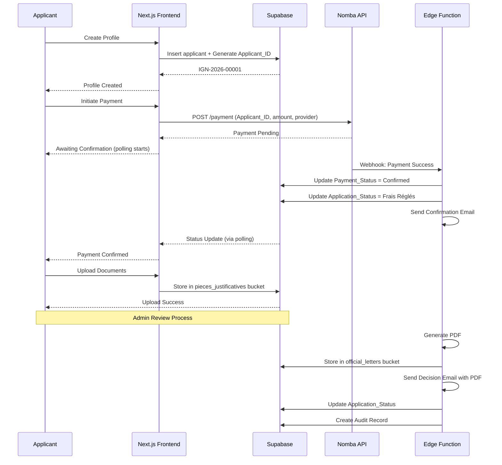

# Infrastructure Design Document: Ignito Academy Admission Management System

## Overview

The Ignito Academy Admission Management System (AMS) is a full-stack web application built on a serverless architecture using Next.js and Supabase. The system manages the complete admission lifecycle for a distance-learning institution targeting Grade 12 students in the Democratic Republic of Congo.

### System Architecture

The system follows a three-tier architecture:

1. **Presentation Layer**: Next.js 14+ (App Router) with React 18+ and Tailwind CSS
2. **Business Logic Layer**: Supabase Edge Functions (Deno runtime) for serverless operations
3. **Data Layer**: Supabase PostgreSQL with Row Level Security (RLS)

### Key Technical Components

- **Frontend**: Next.js App Router with Server Components and Client Components
- **Authentication**: Supabase Auth with email/password and role-based access control
- **Database**: PostgreSQL 15+ via Supabase with RLS policies
- **Storage**: Supabase Storage for document uploads and generated PDFs
- **Payment Integration**: Nomba DRC API for Mobile Money transactions
- **Email Service**: Supabase email service (SMTP) or Resend via Edge Functions
- **PDF Generation**: @react-pdf/renderer or Puppeteer on Edge Functions
- **State Management**: React Context API + Supabase Realtime subscriptions

### Design Principles

1. **Security First**: All data access controlled via RLS policies
2. **Atomic Operations**: Critical workflows (PDF + Email + Status Update) execute atomically
3. **Idempotency**: Webhook processing handles duplicate notifications gracefully
4. **Audit Trail**: Complete history of all status changes for accreditation compliance
5. **Mobile First**: Responsive design optimized for 320px+ screens
6. **Localization**: All user-facing content in formal academic French


## Architecture

### System Context Diagram

```mermaid
graph TB
    A[Applicant Browser] -->|HTTPS| B[Next.js Frontend]
    C[Admin Browser] -->|HTTPS| B
    B -->|API Calls| D[Supabase]
    D -->|Auth| E[Supabase Auth]
    D -->|Data| F[PostgreSQL + RLS]
    D -->|Files| G[Supabase Storage]
    D -->|Functions| H[Edge Functions]
    H -->|Payment API| I[Nomba DRC API]
    I -->|Webhook| H
    H -->|Email| J[SMTP Service]
    H -->|PDF Gen| K[PDF Library]
    
    style B fill:#4EA6F5
    style D fill:#021463
    style H fill:#021463
```



### Application Flow Diagram



### Technology Stack Details

#### Frontend Stack
- **Framework**: Next.js 14+ (App Router)
- **UI Library**: React 18+
- **Styling**: Tailwind CSS 3+
- **Fonts**: Larken (serif, headings), Inter (sans-serif, body)
- **Form Validation**: Zod + React Hook Form
- **HTTP Client**: Supabase JS Client v2
- **State Management**: React Context + Supabase Realtime

#### Backend Stack
- **BaaS Platform**: Supabase (self-hosted or cloud)
- **Database**: PostgreSQL 15+
- **Runtime**: Deno (Edge Functions)
- **Authentication**: Supabase Auth (JWT-based)
- **Storage**: Supabase Storage (S3-compatible)

#### External Services
- **Payment Gateway**: Nomba DRC API (Mobile Money)
- **Email Service**: Supabase SMTP or Resend
- **PDF Generation**: @react-pdf/renderer or Puppeteer


## Components and Interfaces

### Frontend Components

#### Public Components
1. **LandingPage** (`app/page.tsx`)
   - Bilingual hero section with language toggle
   - Academic pathway timeline
   - CTA button routing to application portal
   - Responsive design (320px+)

2. **ApplicationForm** (`app/apply/page.tsx`)
   - Multi-step form: Profile → Academic History → Payment
   - Real-time validation with Zod schemas
   - Applicant_ID generation on profile submission
   - Payment provider selection (M-Pesa, Orange Money, Airtel Money)

3. **PaymentStatus** (`app/apply/payment/[applicantId]/page.tsx`)
   - Polling mechanism (5-second intervals)
   - Payment status display
   - Retry button for failed payments
   - Auto-redirect on confirmation

4. **ApplicantDashboard** (`app/dashboard/page.tsx`)
   - Protected route (requires authentication)
   - Application status display
   - Document upload interface (enabled after payment)
   - Payment retry functionality

#### Administrative Components
1. **AdminDashboard** (`app/admin/page.tsx`)
   - Protected route (requires admissions_officer role)
   - Searchable/filterable application table
   - Columns: Applicant_ID, Prénom, Nom, Exam Status, Payment_Status, Application_Status
   - Row click → Detail view

2. **ApplicationDetail** (`app/admin/applications/[id]/page.tsx`)
   - Full application view with uploaded documents
   - Decision action buttons (Admission sous réserve, Admission définitive, Dossier refusé)
   - Optimistic locking version check
   - Document preview/download

3. **AuditTrailViewer** (`app/admin/audit/page.tsx`)
   - Filterable audit log
   - Export functionality for accreditation
   - Read-only interface

### API Routes (Next.js Route Handlers)

1. **POST /api/applicants/create**
   - Input: { prenom, nom, date_naissance, telephone, email, password }
   - Output: { applicant_id, user_id }
   - Generates Applicant_ID with sequence counter

2. **POST /api/payment/initiate**
   - Input: { applicant_id, provider }
   - Output: { payment_url, transaction_id }
   - Calls Nomba API

3. **GET /api/payment/status/[applicantId]**
   - Output: { payment_status, application_status }
   - Used by polling mechanism

4. **POST /api/documents/upload**
   - Input: FormData with file
   - Output: { file_path, upload_timestamp }
   - Validates size/extension, stores in Supabase Storage

### Supabase Edge Functions

1. **payment-webhook** (`supabase/functions/payment-webhook/index.ts`)
   - Receives Nomba webhook callbacks
   - Validates webhook signature
   - Updates Payment_Status and Application_Status
   - Sends confirmation email
   - Idempotent processing

2. **admin-decision** (`supabase/functions/admin-decision/index.ts`)
   - Input: { applicant_id, decision_type, admin_id }
   - Atomic operation:
     1. Generate PDF (conditional/final acceptance letter)
     2. Upload PDF to official_letters bucket
     3. Send email with PDF attachment
     4. Update Application_Status
     5. Create audit record
   - Rollback on any failure

3. **generate-applicant-id** (`supabase/functions/generate-applicant-id/index.ts`)
   - Input: { intake_year }
   - Output: { applicant_id }
   - Atomic sequence increment with row-level locking
   - Format: IGN-[YEAR]-[SEQUENCE]

### External API Interfaces

#### Nomba DRC API

**Payment Initiation**
```typescript
POST https://api.nomba.com/v1/payments/initiate
Headers:
  Authorization: Bearer {API_KEY}
  Content-Type: application/json

Body:
{
  "amount": 29.00,
  "currency": "USD",
  "provider": "mpesa" | "orange_money" | "airtel_money",
  "reference": "IGN-2026-00001",
  "callback_url": "https://[PROJECT].supabase.co/functions/v1/payment-webhook",
  "metadata": {
    "applicant_id": "IGN-2026-00001"
  }
}

Response:
{
  "transaction_id": "NMB-TXN-123456",
  "payment_url": "https://pay.nomba.com/...",
  "status": "pending"
}
```

**Webhook Payload**
```typescript
POST /functions/v1/payment-webhook
Headers:
  X-Nomba-Signature: {HMAC_SHA256_SIGNATURE}
  Content-Type: application/json

Body:
{
  "transaction_id": "NMB-TXN-123456",
  "reference": "IGN-2026-00001",
  "status": "success" | "failed",
  "amount": 29.00,
  "currency": "USD",
  "provider": "mpesa",
  "timestamp": "2026-01-27T10:30:00Z"
}
```


## Data Models

### Database Schema (PostgreSQL)

#### Table: `applicants`
Stores base user profile information for all applicants.

```sql
CREATE TABLE applicants (
  id UUID PRIMARY KEY DEFAULT gen_random_uuid(),
  email VARCHAR(255) NOT NULL UNIQUE,
  phone_number VARCHAR(13) NOT NULL UNIQUE,
  prenom VARCHAR(100) NOT NULL,
  nom VARCHAR(100) NOT NULL,
  date_naissance DATE NOT NULL,
  password_hash TEXT NOT NULL,
  created_at TIMESTAMPTZ NOT NULL DEFAULT NOW(),
  updated_at TIMESTAMPTZ NOT NULL DEFAULT NOW(),
  
  CONSTRAINT phone_format CHECK (phone_number ~ '^\+243[0-9]{9}$'),
  CONSTRAINT email_format CHECK (email ~* '^[A-Za-z0-9._%+-]+@[A-Za-z0-9.-]+\.[A-Za-z]{2,}$')
);

CREATE INDEX idx_applicants_email ON applicants(email);
CREATE INDEX idx_applicants_phone ON applicants(phone_number);
```

#### Table: `applications`
Stores application records (1-to-Many relationship with applicants).

```sql
CREATE TYPE application_status_enum AS ENUM (
  'Dossier Créé',
  'Frais Réglés',
  'En Cours d''Évaluation',
  'Admission sous réserve',
  'Admission définitive',
  'Dossier refusé'
);

CREATE TYPE payment_status_enum AS ENUM (
  'Pending',
  'Confirmed',
  'Failed'
);

CREATE TYPE exam_status_enum AS ENUM (
  'En attente des résultats',
  'Diplôme obtenu'
);

CREATE TABLE applications (
  id UUID PRIMARY KEY DEFAULT gen_random_uuid(),
  applicant_id VARCHAR(20) NOT NULL UNIQUE,
  user_id UUID NOT NULL REFERENCES applicants(id) ON DELETE CASCADE,
  intake_year INTEGER NOT NULL,
  
  -- Academic History
  ecole_provenance VARCHAR(255) NOT NULL,
  option_academique VARCHAR(100) NOT NULL,
  exam_status exam_status_enum NOT NULL,
  
  -- Status Fields
  application_status application_status_enum NOT NULL DEFAULT 'Dossier Créé',
  payment_status payment_status_enum NOT NULL DEFAULT 'Pending',
  
  -- Payment Tracking
  transaction_id VARCHAR(100),
  payment_confirmed_at TIMESTAMPTZ,
  
  -- Optimistic Locking
  version INTEGER NOT NULL DEFAULT 1,
  
  -- Timestamps
  created_at TIMESTAMPTZ NOT NULL DEFAULT NOW(),
  updated_at TIMESTAMPTZ NOT NULL DEFAULT NOW(),
  
  CONSTRAINT applicant_id_format CHECK (applicant_id ~ '^IGN-[0-9]{4}-[0-9]{5}$'),
  CONSTRAINT intake_year_valid CHECK (intake_year >= 2025 AND intake_year <= 2050),
  CONSTRAINT payment_confirmed_when_status_paid CHECK (
    (payment_status = 'Confirmed' AND payment_confirmed_at IS NOT NULL) OR
    (payment_status != 'Confirmed' AND payment_confirmed_at IS NULL)
  )
);

CREATE INDEX idx_applications_user_id ON applications(user_id);
CREATE INDEX idx_applications_applicant_id ON applications(applicant_id);
CREATE INDEX idx_applications_intake_year ON applications(intake_year);
CREATE INDEX idx_applications_status ON applications(application_status, payment_status);
```

#### Table: `applicant_id_sequences`
Manages sequential counter for Applicant_ID generation.

```sql
CREATE TABLE applicant_id_sequences (
  intake_year INTEGER PRIMARY KEY,
  current_sequence INTEGER NOT NULL DEFAULT 0,
  updated_at TIMESTAMPTZ NOT NULL DEFAULT NOW(),
  
  CONSTRAINT sequence_range CHECK (current_sequence >= 0 AND current_sequence <= 99999)
);

-- Initialize for current year
INSERT INTO applicant_id_sequences (intake_year, current_sequence) 
VALUES (2026, 0);
```

#### Table: `admissions_officers`
Stores administrative user accounts.

```sql
CREATE TABLE admissions_officers (
  id UUID PRIMARY KEY DEFAULT gen_random_uuid(),
  email VARCHAR(255) NOT NULL UNIQUE,
  password_hash TEXT NOT NULL,
  prenom VARCHAR(100) NOT NULL,
  nom VARCHAR(100) NOT NULL,
  role VARCHAR(50) NOT NULL DEFAULT 'admissions_officer',
  is_active BOOLEAN NOT NULL DEFAULT TRUE,
  created_at TIMESTAMPTZ NOT NULL DEFAULT NOW(),
  updated_at TIMESTAMPTZ NOT NULL DEFAULT NOW()
);

CREATE INDEX idx_admissions_officers_email ON admissions_officers(email);
```

#### Table: `audit_trail`
Immutable log of all application status changes.

```sql
CREATE TABLE audit_trail (
  id UUID PRIMARY KEY DEFAULT gen_random_uuid(),
  applicant_id VARCHAR(20) NOT NULL,
  admin_id UUID NOT NULL REFERENCES admissions_officers(id),
  previous_status application_status_enum NOT NULL,
  new_status application_status_enum NOT NULL,
  notes TEXT,
  created_at TIMESTAMPTZ NOT NULL DEFAULT NOW()
);

CREATE INDEX idx_audit_trail_applicant_id ON audit_trail(applicant_id);
CREATE INDEX idx_audit_trail_admin_id ON audit_trail(admin_id);
CREATE INDEX idx_audit_trail_created_at ON audit_trail(created_at DESC);

-- Prevent modifications to audit records
CREATE RULE audit_trail_no_update AS ON UPDATE TO audit_trail DO INSTEAD NOTHING;
CREATE RULE audit_trail_no_delete AS ON DELETE TO audit_trail DO INSTEAD NOTHING;
```

#### Table: `uploaded_documents`
Tracks document uploads with metadata.

```sql
CREATE TABLE uploaded_documents (
  id UUID PRIMARY KEY DEFAULT gen_random_uuid(),
  applicant_id VARCHAR(20) NOT NULL,
  user_id UUID NOT NULL REFERENCES applicants(id) ON DELETE CASCADE,
  file_name VARCHAR(255) NOT NULL,
  file_path TEXT NOT NULL,
  file_size_bytes INTEGER NOT NULL,
  mime_type VARCHAR(100) NOT NULL,
  uploaded_at TIMESTAMPTZ NOT NULL DEFAULT NOW(),
  
  CONSTRAINT file_size_limit CHECK (file_size_bytes <= 5242880), -- 5MB
  CONSTRAINT mime_type_allowed CHECK (mime_type IN (
    'application/pdf',
    'image/jpeg',
    'image/jpg',
    'image/png'
  ))
);

CREATE INDEX idx_uploaded_documents_applicant_id ON uploaded_documents(applicant_id);
CREATE INDEX idx_uploaded_documents_user_id ON uploaded_documents(user_id);
```

#### Table: `email_logs`
Tracks email delivery status for reliability monitoring.

```sql
CREATE TYPE email_status_enum AS ENUM ('sent', 'failed', 'pending');

CREATE TABLE email_logs (
  id UUID PRIMARY KEY DEFAULT gen_random_uuid(),
  applicant_id VARCHAR(20) NOT NULL,
  recipient_email VARCHAR(255) NOT NULL,
  subject TEXT NOT NULL,
  email_type VARCHAR(50) NOT NULL, -- 'payment_confirmation', 'conditional_acceptance', 'final_acceptance'
  status email_status_enum NOT NULL DEFAULT 'pending',
  error_message TEXT,
  retry_count INTEGER NOT NULL DEFAULT 0,
  sent_at TIMESTAMPTZ,
  created_at TIMESTAMPTZ NOT NULL DEFAULT NOW(),
  
  CONSTRAINT max_retries CHECK (retry_count <= 3)
);

CREATE INDEX idx_email_logs_applicant_id ON email_logs(applicant_id);
CREATE INDEX idx_email_logs_status ON email_logs(status);
```

#### Table: `webhook_logs`
Tracks incoming Nomba webhooks to ensure idempotency and prevent duplicate payment processing.

```sql
CREATE TABLE webhook_logs (
  id UUID PRIMARY KEY DEFAULT gen_random_uuid(),
  transaction_id VARCHAR(100) NOT NULL UNIQUE,
  payload JSONB NOT NULL,
  received_at TIMESTAMPTZ NOT NULL DEFAULT NOW()
);

CREATE INDEX idx_webhook_logs_transaction_id ON webhook_logs(transaction_id);

ALTER TABLE webhook_logs ENABLE ROW LEVEL SECURITY;

-- Only system/service role can interact with webhook logs
CREATE POLICY webhook_logs_service_role_all
  ON webhook_logs
  USING (TRUE)
  WITH CHECK (TRUE);
```

### Database Functions

#### Function: `generate_applicant_id()`
Atomically generates next Applicant_ID for given intake year.

```sql
CREATE OR REPLACE FUNCTION generate_applicant_id(p_intake_year INTEGER)
RETURNS VARCHAR(20)
LANGUAGE plpgsql
AS $$
DECLARE
  v_sequence INTEGER;
  v_applicant_id VARCHAR(20);
BEGIN
  -- Lock row for update to prevent race conditions
  SELECT current_sequence INTO v_sequence
  FROM applicant_id_sequences
  WHERE intake_year = p_intake_year
  FOR UPDATE;
  
  -- If year doesn't exist, initialize it
  IF v_sequence IS NULL THEN
    INSERT INTO applicant_id_sequences (intake_year, current_sequence)
    VALUES (p_intake_year, 0)
    RETURNING current_sequence INTO v_sequence;
  END IF;
  
  -- Increment sequence
  v_sequence := v_sequence + 1;
  
  -- Update sequence counter
  UPDATE applicant_id_sequences
  SET current_sequence = v_sequence, updated_at = NOW()
  WHERE intake_year = p_intake_year;
  
  -- Format Applicant_ID
  v_applicant_id := 'IGN-' || p_intake_year::TEXT || '-' || LPAD(v_sequence::TEXT, 5, '0');
  
  RETURN v_applicant_id;
END;
$$;
```

#### Function: `update_application_status_with_version_check()`
Updates application status with optimistic locking.

```sql
CREATE OR REPLACE FUNCTION update_application_status_with_version_check(
  p_applicant_id VARCHAR(20),
  p_new_status application_status_enum,
  p_expected_version INTEGER
)
RETURNS BOOLEAN
LANGUAGE plpgsql
AS $$
DECLARE
  v_current_version INTEGER;
  v_rows_updated INTEGER;
BEGIN
  -- Check current version
  SELECT version INTO v_current_version
  FROM applications
  WHERE applicant_id = p_applicant_id
  FOR UPDATE;
  
  -- Version mismatch (concurrent edit detected)
  IF v_current_version != p_expected_version THEN
    RETURN FALSE;
  END IF;
  
  -- Update with version increment
  UPDATE applications
  SET 
    application_status = p_new_status,
    version = version + 1,
    updated_at = NOW()
  WHERE applicant_id = p_applicant_id;
  
  GET DIAGNOSTICS v_rows_updated = ROW_COUNT;
  
  RETURN v_rows_updated = 1;
END;
$$;
```

#### Trigger: `update_updated_at_timestamp()`
Automatically updates `updated_at` column on row modification.

```sql
CREATE OR REPLACE FUNCTION update_updated_at_timestamp()
RETURNS TRIGGER
LANGUAGE plpgsql
AS $$
BEGIN
  NEW.updated_at = NOW();
  RETURN NEW;
END;
$$;

CREATE TRIGGER applicants_updated_at BEFORE UPDATE ON applicants
  FOR EACH ROW EXECUTE FUNCTION update_updated_at_timestamp();

CREATE TRIGGER applications_updated_at BEFORE UPDATE ON applications
  FOR EACH ROW EXECUTE FUNCTION update_updated_at_timestamp();

CREATE TRIGGER admissions_officers_updated_at BEFORE UPDATE ON admissions_officers
  FOR EACH ROW EXECUTE FUNCTION update_updated_at_timestamp();
```


### Row Level Security (RLS) Policies

#### RLS Policies for `applicants` table

```sql
-- Enable RLS
ALTER TABLE applicants ENABLE ROW LEVEL SECURITY;

-- Applicants can read their own profile
CREATE POLICY applicants_select_own
  ON applicants FOR SELECT
  USING (auth.uid() = id);

-- Applicants can update their own profile (except email/phone after creation)
CREATE POLICY applicants_update_own
  ON applicants FOR UPDATE
  USING (auth.uid() = id)
  WITH CHECK (
    auth.uid() = id AND
    email = (SELECT email FROM applicants WHERE id = auth.uid()) AND
    phone_number = (SELECT phone_number FROM applicants WHERE id = auth.uid())
  );

-- Admissions officers can read all applicants
CREATE POLICY applicants_select_admin
  ON applicants FOR SELECT
  USING (
    EXISTS (
      SELECT 1 FROM admissions_officers
      WHERE id = auth.uid() AND is_active = TRUE
    )
  );

-- Public insert for registration
CREATE POLICY applicants_insert_public
  ON applicants FOR INSERT
  WITH CHECK (TRUE);
```

#### RLS Policies for `applications` table

```sql
ALTER TABLE applications ENABLE ROW LEVEL SECURITY;

-- Applicants can read their own applications
CREATE POLICY applications_select_own
  ON applications FOR SELECT
  USING (user_id = auth.uid());

-- Applicants can update their own applications (before payment only)
CREATE POLICY applications_update_own
  ON applications FOR UPDATE
  USING (user_id = auth.uid() AND payment_status != 'Confirmed')
  WITH CHECK (
    user_id = auth.uid() AND
    payment_status != 'Confirmed' AND
    application_status = 'Dossier Créé'
  );

-- Applicants can insert their own applications
CREATE POLICY applications_insert_own
  ON applications FOR INSERT
  WITH CHECK (user_id = auth.uid());

-- Admissions officers can read all applications
CREATE POLICY applications_select_admin
  ON applications FOR SELECT
  USING (
    EXISTS (
      SELECT 1 FROM admissions_officers
      WHERE id = auth.uid() AND is_active = TRUE
    )
  );

-- Admissions officers can update application status
CREATE POLICY applications_update_admin
  ON applications FOR UPDATE
  USING (
    EXISTS (
      SELECT 1 FROM admissions_officers
      WHERE id = auth.uid() AND is_active = TRUE
    )
  )
  WITH CHECK (
    EXISTS (
      SELECT 1 FROM admissions_officers
      WHERE id = auth.uid() AND is_active = TRUE
    )
  );
```

#### RLS Policies for `uploaded_documents` table

```sql
ALTER TABLE uploaded_documents ENABLE ROW LEVEL SECURITY;

-- Applicants can read their own documents
CREATE POLICY uploaded_documents_select_own
  ON uploaded_documents FOR SELECT
  USING (user_id = auth.uid());

-- Applicants can insert their own documents (after payment confirmed)
CREATE POLICY uploaded_documents_insert_own
  ON uploaded_documents FOR INSERT
  WITH CHECK (
    user_id = auth.uid() AND
    EXISTS (
      SELECT 1 FROM applications
      WHERE applications.applicant_id = uploaded_documents.applicant_id
        AND applications.user_id = auth.uid()
        AND applications.payment_status = 'Confirmed'
    )
  );

-- Admissions officers can read all documents
CREATE POLICY uploaded_documents_select_admin
  ON uploaded_documents FOR SELECT
  USING (
    EXISTS (
      SELECT 1 FROM admissions_officers
      WHERE id = auth.uid() AND is_active = TRUE
    )
  );
```

#### RLS Policies for `audit_trail` table

```sql
ALTER TABLE audit_trail ENABLE ROW LEVEL SECURITY;

-- Only admissions officers can read audit trail
CREATE POLICY audit_trail_select_admin
  ON audit_trail FOR SELECT
  USING (
    EXISTS (
      SELECT 1 FROM admissions_officers
      WHERE id = auth.uid() AND is_active = TRUE
    )
  );

-- Only admissions officers can insert audit records
CREATE POLICY audit_trail_insert_admin
  ON audit_trail FOR INSERT
  WITH CHECK (
    EXISTS (
      SELECT 1 FROM admissions_officers
      WHERE id = auth.uid() AND is_active = TRUE
    )
  );

-- No updates or deletes allowed (enforced by rules)
```

#### RLS Policies for `email_logs` table

```sql
ALTER TABLE email_logs ENABLE ROW LEVEL SECURITY;

-- Only admissions officers can read email logs
CREATE POLICY email_logs_select_admin
  ON email_logs FOR SELECT
  USING (
    EXISTS (
      SELECT 1 FROM admissions_officers
      WHERE id = auth.uid() AND is_active = TRUE
    )
  );

-- System can insert email logs (via service role)
CREATE POLICY email_logs_insert_system
  ON email_logs FOR INSERT
  WITH CHECK (TRUE);

-- System can update email logs for retry logic
CREATE POLICY email_logs_update_system
  ON email_logs FOR UPDATE
  USING (TRUE)
  WITH CHECK (TRUE);
```

### Storage Architecture

#### Bucket: `pieces_justificatives`
Stores applicant-uploaded documents (exam results, certificates).

**Configuration:**
```typescript
{
  name: 'pieces_justificatives',
  public: false,
  fileSizeLimit: 5242880, // 5MB
  allowedMimeTypes: [
    'application/pdf',
    'image/jpeg',
    'image/jpg',
    'image/png'
  ]
}
```

**Folder Structure:**
```
pieces_justificatives/
  ├── 2026/
  │   ├── IGN-2026-00001/
  │   │   ├── bulletin_1.pdf
  │   │   ├── certificat_naissance.jpg
  │   │   └── ...
  │   ├── IGN-2026-00002/
  │   └── ...
  └── 2027/
      └── ...
```

**RLS Policies:**
```sql
-- Applicants can upload to their own folder (after payment)
CREATE POLICY pieces_justificatives_insert_own
  ON storage.objects FOR INSERT
  WITH CHECK (
    bucket_id = 'pieces_justificatives' AND
    (storage.foldername(name))[1] = (
      SELECT intake_year::TEXT FROM applications
      WHERE user_id = auth.uid() AND payment_status = 'Confirmed'
      LIMIT 1
    ) AND
    (storage.foldername(name))[2] = (
      SELECT applicant_id FROM applications
      WHERE user_id = auth.uid() AND payment_status = 'Confirmed'
      LIMIT 1
    )
  );

-- Applicants can read their own documents
CREATE POLICY pieces_justificatives_select_own
  ON storage.objects FOR SELECT
  USING (
    bucket_id = 'pieces_justificatives' AND
    (storage.foldername(name))[2] IN (
      SELECT applicant_id FROM applications WHERE user_id = auth.uid()
    )
  );

-- Admissions officers can read all documents
CREATE POLICY pieces_justificatives_select_admin
  ON storage.objects FOR SELECT
  USING (
    bucket_id = 'pieces_justificatives' AND
    EXISTS (
      SELECT 1 FROM admissions_officers
      WHERE id = auth.uid() AND is_active = TRUE
    )
  );
```

#### Bucket: `official_letters`
Stores system-generated PDF acceptance letters.

**Configuration:**
```typescript
{
  name: 'official_letters',
  public: false,
  fileSizeLimit: 10485760, // 10MB
  allowedMimeTypes: ['application/pdf']
}
```

**Folder Structure:**
```
official_letters/
  ├── 2026/
  │   ├── IGN-2026-00001-conditional-20260127.pdf
  │   ├── IGN-2026-00001-final-20260215.pdf
  │   ├── IGN-2026-00002-conditional-20260128.pdf
  │   └── ...
  └── 2027/
      └── ...
```

**RLS Policies:**
```sql
-- Only Edge Functions can insert (via service role)
CREATE POLICY official_letters_insert_system
  ON storage.objects FOR INSERT
  WITH CHECK (bucket_id = 'official_letters');

-- Applicants can read their own letters
CREATE POLICY official_letters_select_own
  ON storage.objects FOR SELECT
  USING (
    bucket_id = 'official_letters' AND
    name LIKE '%' || (
      SELECT applicant_id FROM applications WHERE user_id = auth.uid() LIMIT 1
    ) || '%'
  );

-- Admissions officers can read all letters
CREATE POLICY official_letters_select_admin
  ON storage.objects FOR SELECT
  USING (
    bucket_id = 'official_letters' AND
    EXISTS (
      SELECT 1 FROM admissions_officers
      WHERE id = auth.uid() AND is_active = TRUE
    )
  );
```


### Authentication and Authorization

#### Supabase Auth Configuration

**User Roles:**
- `applicant`: Standard user role for prospective students
- `admissions_officer`: Administrative role for staff

**Authentication Flow:**

1. **Applicant Registration**
```typescript
// Client-side registration
const { data, error } = await supabase.auth.signUp({
  email: formData.email,
  password: formData.password,
  options: {
    data: {
      prenom: formData.prenom,
      nom: formData.nom,
      date_naissance: formData.date_naissance,
      phone_number: formData.phone_number,
      role: 'applicant'
    }
  }
});

// Trigger: Create applicant record in applicants table
// Trigger: Generate Applicant_ID and create application record
```

2. **Admissions Officer Creation (Manual)**
```sql
-- Admin script (run via Supabase SQL Editor)
INSERT INTO auth.users (email, encrypted_password, email_confirmed_at, role)
VALUES (
  '[email]',
  crypt('[password]', gen_salt('bf')),
  NOW(),
  'authenticated'
);

INSERT INTO admissions_officers (id, email, prenom, nom, role)
VALUES (
  (SELECT id FROM auth.users WHERE email = '[email]'),
  '[email]',
  '[prenom]',
  '[nom]',
  'admissions_officer'
);
```

3. **Role-Based Access Control**
```typescript
// Middleware: Check user role
export async function checkAdminRole(req: Request) {
  const { data: { user } } = await supabase.auth.getUser();
  
  if (!user) {
    throw new Error('Unauthorized');
  }
  
  const { data: officer } = await supabase
    .from('admissions_officers')
    .select('id, is_active')
    .eq('id', user.id)
    .single();
  
  if (!officer || !officer.is_active) {
    throw new Error('Forbidden: Admissions Officer access required');
  }
  
  return officer;
}
```


## Correctness Properties

*A property is a characteristic or behavior that should hold true across all valid executions of a system—essentially, a formal statement about what the system should do. Properties serve as the bridge between human-readable specifications and machine-verifiable correctness guarantees.*

### Property Reflection

After analyzing all acceptance criteria, I identified the following areas of potential redundancy:

1. **Applicant_ID Format Properties**: Requirements 1.2, 18.1-18.4 all relate to ID format - these can be consolidated into comprehensive format and generation properties
2. **Phone Number Validation**: Requirements 1.6, 23.1-23.4 overlap - can be combined into format validation and round-trip properties
3. **Payment Status Transitions**: Requirements 4.4-4.7 describe related state changes - can be unified into payment workflow properties
4. **Document Upload Access Control**: Requirements 6.1-6.2 are complementary - can be combined into conditional access property
5. **Atomic Decision Operations**: Requirements 12.7, 13.7, 22.1-22.4 all describe the same atomicity guarantee - should be one comprehensive property
6. **Audit Trail Properties**: Requirements 10.7, 14.1-14.2 overlap - can be consolidated into audit completeness property
7. **Email Triggering**: Requirements 5.1, 12.4, 13.4 describe similar email triggers - can be generalized
8. **Status Transition Validation**: Requirement 24 encompasses many individual transition checks - should be comprehensive properties

After reflection, I've eliminated redundant properties and consolidated related criteria into comprehensive, non-overlapping properties.

### Property 1: Applicant ID Format Invariant

*For any* generated Applicant_ID, the format SHALL match the pattern `IGN-[4_DIGIT_YEAR]-[5_DIGIT_SEQUENCE]` where YEAR is a valid Intake_Year (2025-2050) and SEQUENCE is zero-padded to exactly 5 digits (00001-99999).

**Validates: Requirements 1.2, 18.1, 18.3**

### Property 2: Applicant ID Round-Trip

*For any* valid Applicant_ID, parsing the ID to extract year and sequence components, then formatting those components back to a string, SHALL produce the original Applicant_ID.

**Validates: Requirements 18.5**

### Property 3: Applicant ID Uniqueness

*For all* applications created within the same Intake_Year, no two applications SHALL have the same Applicant_ID.

**Validates: Requirements 1.2, 30.3**

### Property 4: Applicant ID Sequence Monotonicity

*For any* two applications created sequentially within the same Intake_Year, the second application's sequence number SHALL be exactly one greater than the first application's sequence number.

**Validates: Requirements 18.4**

### Property 5: Intake Year Sequence Reset

*For any* Intake_Year transition, the first Applicant_ID generated in the new year SHALL have sequence 00001.

**Validates: Requirements 1.3, 27.4**

### Property 6: Email Uniqueness Enforcement

*For any* two applicants in the database, they SHALL NOT have the same email address.

**Validates: Requirements 1.4, 30.1**

### Property 7: Phone Number Uniqueness Enforcement

*For any* two applicants in the database, they SHALL NOT have the same phone_number.

**Validates: Requirements 1.5, 30.2**

### Property 8: Phone Number Format Invariant

*For all* stored phone numbers, the format SHALL match `+243[9_DIGITS]` (exactly 13 characters total).

**Validates: Requirements 1.6, 23.1, 23.2, 23.4**

### Property 9: Phone Number Round-Trip

*For any* valid phone number, formatting to E.164, parsing to extract components, then formatting again SHALL produce the original phone number.

**Validates: Requirements 23.5**

### Property 10: Initial Application Status

*For any* newly created application, the Application_Status SHALL be "Dossier Créé" and Payment_Status SHALL be "Pending".

**Validates: Requirements 1.7, 4.4**

### Property 11: Payment Confirmation Triggers Status Update

*For any* application, WHEN Payment_Status transitions from "Pending" to "Confirmed", THEN Application_Status SHALL transition from "Dossier Créé" to "Frais Réglés".

**Validates: Requirements 4.5, 4.6**

### Property 12: Payment Confirmation Triggers Email

*For any* application, WHEN Payment_Status transitions to "Confirmed", THEN exactly one confirmation email SHALL be sent to the applicant's registered email address containing the Applicant_ID.

**Validates: Requirements 5.1, 5.3, 5.4**

### Property 13: Document Upload Requires Payment

*For all* applications, IF Pièces_Justificatives are uploaded, THEN Payment_Status SHALL be "Confirmed".

**Validates: Requirements 6.1, 6.2, 30.3**

### Property 14: File Extension Validation

*For all* uploaded files, the file extension SHALL be one of: .pdf, .jpg, .jpeg, .png.

**Validates: Requirements 6.3, 20.1**

### Property 15: File Size Validation

*For all* uploaded files, the file size SHALL be less than or equal to 5,242,880 bytes (5MB).

**Validates: Requirements 6.4, 20.2**

### Property 16: File MIME Type Consistency

*For any* uploaded file, the MIME type SHALL match the file extension (e.g., .pdf → application/pdf, .jpg/.jpeg → image/jpeg, .png → image/png).

**Validates: Requirements 20.3**

### Property 17: File Storage Path Uniqueness

*For all* uploaded files, each file SHALL have a unique storage path with no collisions.

**Validates: Requirements 20.4**

### Property 18: File Access Control

*For any* uploaded file, access SHALL be restricted to the owning applicant (user_id match) and admissions officers only.

**Validates: Requirements 20.6**

### Property 19: Academic History Update Window

*For any* application, academic history fields (ecole_provenance, option_academique, exam_status) SHALL be updatable IF AND ONLY IF Payment_Status is NOT "Confirmed".

**Validates: Requirements 2.4**

### Property 20: Exam Status Enum Validation

*For all* applications, the exam_status field SHALL contain only one of exactly two values: "En attente des résultats" OR "Diplôme obtenu".

**Validates: Requirements 2.2**

### Property 21: Reapplication Independence

*For all* applicants with multiple applications across different Intake_Years, each application SHALL have a unique Applicant_ID and SHALL be processed independently (status changes to one application SHALL NOT affect other applications by the same user).

**Validates: Requirements 8.3, 8.4, 8.5**

### Property 22: Reapplication ID Generation

*For any* applicant creating a new application for a different Intake_Year, the new Applicant_ID SHALL use the current Intake_Year in the year component and a new sequence number.

**Validates: Requirements 8.2**

### Property 23: Role-Based Dashboard Access

*For any* user attempting to access the Bureau des Admissions dashboard, access SHALL be granted IF AND ONLY IF the user exists in the admissions_officers table with is_active = TRUE.

**Validates: Requirements 9.1, 17.5**

### Property 24: Admissions Officer Registration Restriction

*For all* public registration endpoints, creating an account with role "admissions_officer" SHALL be rejected.

**Validates: Requirements 17.1**

### Property 25: Status Transition Validity - Payment to Review

*For any* application, transition from "Dossier Créé" to "Frais Réglés" SHALL be allowed IF AND ONLY IF Payment_Status is "Confirmed".

**Validates: Requirements 24.1**

### Property 26: Status Transition Validity - Final Acceptance Lock

*For all* applications with Application_Status "Admission définitive", no further status changes SHALL be allowed.

**Validates: Requirements 10.5, 24.5**

### Property 27: Status Transition Validity - Conditional to Final Upgrade

*For any* application with Application_Status "Admission sous réserve", transition to "Admission définitive" SHALL be allowed.

**Validates: Requirements 10.6, 24.4**

### Property 28: Status Transition Validity - Rejection Lock

*For all* applications with Application_Status "Dossier refusé", no further status changes SHALL be allowed.

**Validates: Requirements 24.6**

### Property 29: Concurrent Edit Detection

*For any* Application_Status change attempt, IF another admissions officer has modified the application since it was loaded (version mismatch), THEN the change SHALL be rejected and a warning SHALL be displayed.

**Validates: Requirements 11.2, 11.3**

### Property 30: Atomic Decision Operation - Conditional Acceptance

*For any* application, WHEN Application_Status changes to "Admission sous réserve", THEN the following SHALL execute atomically: (1) PDF generation with applicant details, (2) PDF storage in official_letters bucket, (3) email sending with PDF attachment, (4) Application_Status update, (5) audit record creation. IF any step fails, ALL changes SHALL be rolled back.

**Validates: Requirements 12.1, 12.4, 12.5, 12.7, 22.1, 22.2**

### Property 31: Atomic Decision Operation - Final Acceptance

*For any* application, WHEN Application_Status changes to "Admission définitive", THEN the following SHALL execute atomically: (1) PDF generation with applicant details, (2) PDF storage in official_letters bucket, (3) email sending with PDF attachment, (4) Application_Status update, (5) audit record creation. IF any step fails, ALL changes SHALL be rolled back.

**Validates: Requirements 13.1, 13.4, 13.5, 13.7, 22.1, 22.2**

### Property 32: Audit Trail Completeness

*For all* Application_Status changes, exactly one audit record SHALL be created containing admin_id, applicant_id, previous_status, new_status, and timestamp.

**Validates: Requirements 10.7, 14.1, 14.2**

### Property 33: Audit Trail Immutability

*For all* audit records, once created, the record SHALL never be modified or deleted.

**Validates: Requirements 14.3, 14.5**

### Property 34: PDF Content Completeness - Conditional Acceptance

*For any* conditional acceptance PDF, the document SHALL contain: Ignito Academy logo, Applicant_ID, Prénom, Nom, conditional acceptance terms, digital signature from environment variable, and footer text from environment variable, all in formal academic French.

**Validates: Requirements 12.2, 12.3, 12.6**

### Property 35: PDF Content Completeness - Final Acceptance

*For any* final acceptance PDF, the document SHALL contain: Ignito Academy logo, Applicant_ID, Prénom, Nom, final acceptance confirmation, digital signature from environment variable, and footer text from environment variable, all in formal academic French.

**Validates: Requirements 13.2, 13.3, 13.6**

### Property 36: PDF Filename Format

*For all* generated PDF documents, the filename SHALL match the pattern `[APPLICANT_ID]-[DECISION_TYPE]-[TIMESTAMP].pdf` where DECISION_TYPE is "conditional" or "final".

**Validates: Requirements 25.7**

### Property 37: Webhook Idempotency

*For all* payment webhooks received multiple times with the same transaction_id, the Payment_Status SHALL be updated exactly once (subsequent webhooks with the same transaction_id SHALL be ignored).

**Validates: Requirements 19.5**

### Property 38: Webhook Signature Validation

*For any* incoming webhook request, IF the X-Nomba-Signature header does not match the computed HMAC-SHA256 signature of the payload, THEN the webhook SHALL be rejected and no status updates SHALL occur.

**Validates: Requirements 19.4**

### Property 39: Email Retry Logic

*For any* failed email send operation, the system SHALL retry up to 3 times with exponential backoff, and SHALL record the retry_count in the email_logs table.

**Validates: Requirements 21.2, 21.3, 21.4**

### Property 40: Language Toggle Idempotence

*For all* language toggle operations on the Conversion_Engine, toggling from French to English and back to French SHALL display the same French content (idempotence property).

**Validates: Requirements 15.3, 15.4**

### Property 41: Intake Year Calculation

*For any* date between September 1st of year N and August 31st of year N+1, the calculated Intake_Year SHALL be N+1.

**Validates: Requirements 27.1, 27.3**

### Property 42: Payment Polling Termination

*For any* application with Payment_Status "Pending", the frontend SHALL poll the database every 5 seconds, and SHALL stop polling WHEN Payment_Status changes to "Confirmed" OR "Failed" OR the user navigates away.

**Validates: Requirements 26.1, 26.4**

### Property 43: Error Message Localization

*For all* validation and system errors displayed to applicants, the error message SHALL be in French language.

**Validates: Requirements 29.1, 29.2**

### Property 44: Database Constraint Enforcement - Status Enums

*For all* applications, the Application_Status field SHALL accept only values from the enum: "Dossier Créé", "Frais Réglés", "En Cours d'Évaluation", "Admission sous réserve", "Admission définitive", "Dossier refusé". The Payment_Status field SHALL accept only: "Pending", "Confirmed", "Failed".

**Validates: Requirements 30.7, 30.8**

### Property 45: Required Field Validation

*For all* applicant records, the fields prenom, nom, date_naissance, email, phone_number SHALL NOT be NULL.

**Validates: Requirements 1.1, 30.6**


## Error Handling

### Error Classification

#### Client Errors (4xx)

1. **Validation Errors (400 Bad Request)**
   - Invalid email format
   - Invalid phone number format
   - Missing required fields
   - File size exceeds 5MB
   - Invalid file extension
   - Whitespace-only input fields

2. **Authentication Errors (401 Unauthorized)**
   - Invalid credentials
   - Expired session token
   - Missing authentication token

3. **Authorization Errors (403 Forbidden)**
   - Non-officer attempting to access admin dashboard
   - Applicant attempting to access another applicant's data
   - Attempting to upload documents before payment confirmation

4. **Resource Not Found (404 Not Found)**
   - Applicant_ID does not exist
   - Application not found
   - Document not found in storage

5. **Conflict Errors (409 Conflict)**
   - Email already registered
   - Phone number already registered
   - Concurrent edit detected (version mismatch)
   - Invalid status transition attempt

#### Server Errors (5xx)

1. **Internal Server Error (500)**
   - Database connection failure
   - Unexpected exception in business logic
   - PDF generation failure
   - Email service unavailable

2. **Service Unavailable (503)**
   - Nomba API timeout
   - Supabase service degradation
   - Storage service unavailable

### Error Response Format

All API errors follow a consistent JSON structure:

```typescript
interface ErrorResponse {
  error: {
    code: string;           // Machine-readable error code
    message: string;        // User-friendly message (French for applicants)
    details?: any;          // Additional context (admin only)
    field?: string;         // Field name for validation errors
    timestamp: string;      // ISO 8601 timestamp
    request_id: string;     // Unique request identifier for debugging
  }
}
```

**Example:**
```json
{
  "error": {
    "code": "INVALID_PHONE_FORMAT",
    "message": "Le numéro de téléphone doit commencer par +243 et contenir 13 caractères.",
    "field": "phone_number",
    "timestamp": "2026-01-27T10:30:00Z",
    "request_id": "req_abc123"
  }
}
```

### Error Handling Strategies

#### 1. Validation Errors

**Strategy**: Fail fast with clear feedback

```typescript
// Frontend validation (Zod schema)
const applicantSchema = z.object({
  email: z.string().email({ message: "Format d'email invalide" }),
  phone_number: z.string().regex(/^\+243[0-9]{9}$/, {
    message: "Le numéro doit commencer par +243 et contenir 13 caractères"
  }),
  prenom: z.string().min(1, { message: "Le prénom est requis" }).trim(),
  nom: z.string().min(1, { message: "Le nom est requis" }).trim(),
  date_naissance: z.date().max(new Date(), {
    message: "La date de naissance ne peut pas être dans le futur"
  })
});

// Backend validation (duplicate check)
const existingEmail = await supabase
  .from('applicants')
  .select('id')
  .eq('email', formData.email)
  .single();

if (existingEmail) {
  throw new ValidationError('EMAIL_ALREADY_EXISTS', 
    'Cette adresse email est déjà enregistrée. Veuillez vous connecter.');
}
```

#### 2. Concurrent Edit Conflicts

**Strategy**: Optimistic locking with user notification

```typescript
async function updateApplicationStatus(
  applicantId: string,
  newStatus: ApplicationStatus,
  expectedVersion: number,
  adminId: string
) {
  const success = await supabase.rpc('update_application_status_with_version_check', {
    p_applicant_id: applicantId,
    p_new_status: newStatus,
    p_expected_version: expectedVersion
  });

  if (!success) {
    throw new ConflictError('CONCURRENT_EDIT_DETECTED',
      'Cette candidature a été modifiée par un autre utilisateur. Veuillez actualiser la page.');
  }

  // Create audit record
  await supabase.from('audit_trail').insert({
    applicant_id: applicantId,
    admin_id: adminId,
    previous_status: currentStatus,
    new_status: newStatus
  });
}
```

#### 3. Atomic Operation Failures

**Strategy**: Rollback with detailed logging

```typescript
async function executeAdminDecision(
  applicantId: string,
  decisionType: 'conditional' | 'final',
  adminId: string
) {
  const operationId = generateOperationId();
  
  try {
    // Step 1: Generate PDF
    logger.info({ operationId, step: 'pdf_generation_start' });
    const pdfBuffer = await generateAcceptancePDF(applicantId, decisionType);
    logger.info({ operationId, step: 'pdf_generation_success' });

    // Step 2: Upload PDF to storage
    logger.info({ operationId, step: 'pdf_upload_start' });
    const pdfPath = await uploadPDFToStorage(pdfBuffer, applicantId, decisionType);
    logger.info({ operationId, step: 'pdf_upload_success', pdfPath });

    // Step 3: Send email with PDF attachment
    logger.info({ operationId, step: 'email_send_start' });
    await sendDecisionEmail(applicantId, decisionType, pdfPath);
    logger.info({ operationId, step: 'email_send_success' });

    // Step 4: Update application status
    logger.info({ operationId, step: 'status_update_start' });
    const newStatus = decisionType === 'conditional' 
      ? 'Admission sous réserve' 
      : 'Admission définitive';
    await updateApplicationStatus(applicantId, newStatus, adminId);
    logger.info({ operationId, step: 'status_update_success' });

    // Step 5: Create audit record
    await createAuditRecord(applicantId, adminId, newStatus);
    
    return { success: true, operationId };

  } catch (error) {
    logger.error({ 
      operationId, 
      step: 'operation_failed', 
      error: error.message,
      stack: error.stack 
    });

    // Rollback: Status update is prevented by not committing
    // PDF remains in storage for manual retry if needed
    
    throw new OperationError('ATOMIC_OPERATION_FAILED',
      'Une erreur est survenue lors du traitement de la décision. Veuillez réessayer.',
      { operationId, details: error.message }
    );
  }
}
```

#### 4. Payment Webhook Failures

**Strategy**: Idempotent processing with retry

```typescript
async function processPaymentWebhook(payload: NombaWebhookPayload) {
  const { transaction_id, reference, status } = payload;

  // Verify signature
  if (!verifyWebhookSignature(payload)) {
    logger.warn({ transaction_id, event: 'invalid_signature' });
    throw new AuthenticationError('INVALID_WEBHOOK_SIGNATURE');
  }

  // Check for duplicate processing (idempotency)
  const existingLog = await supabase
    .from('webhook_logs')
    .select('id')
    .eq('transaction_id', transaction_id)
    .single();

  if (existingLog) {
    logger.info({ transaction_id, event: 'duplicate_webhook_ignored' });
    return { processed: false, reason: 'duplicate' };
  }

  // Log webhook receipt
  await supabase.from('webhook_logs').insert({
    transaction_id,
    payload: JSON.stringify(payload),
    received_at: new Date().toISOString()
  });

  // Update payment status
  const applicantId = reference; // Applicant_ID is used as reference
  const paymentStatus = status === 'success' ? 'Confirmed' : 'Failed';

  await supabase
    .from('applications')
    .update({ 
      payment_status: paymentStatus,
      transaction_id,
      payment_confirmed_at: status === 'success' ? new Date().toISOString() : null,
      application_status: status === 'success' ? 'Frais Réglés' : 'Dossier Créé'
    })
    .eq('applicant_id', applicantId);

  // Send confirmation email if payment successful
  if (status === 'success') {
    await sendPaymentConfirmationEmail(applicantId);
  }

  return { processed: true, applicantId, paymentStatus };
}
```

#### 5. Email Delivery Failures

**Strategy**: Retry with exponential backoff

```typescript
async function sendEmailWithRetry(
  applicantId: string,
  emailType: string,
  emailData: EmailData,
  maxRetries: number = 3
) {
  let retryCount = 0;
  let lastError: Error | null = null;

  while (retryCount <= maxRetries) {
    try {
      // Log email attempt
      const logId = await supabase.from('email_logs').insert({
        applicant_id: applicantId,
        recipient_email: emailData.to,
        subject: emailData.subject,
        email_type: emailType,
        status: 'pending',
        retry_count: retryCount
      }).select('id').single();

      // Send email
      await emailService.send(emailData);

      // Update log to success
      await supabase.from('email_logs')
        .update({ status: 'sent', sent_at: new Date().toISOString() })
        .eq('id', logId.data.id);

      logger.info({ applicantId, emailType, retryCount, status: 'sent' });
      return { success: true };

    } catch (error) {
      lastError = error;
      retryCount++;

      // Update log with error
      await supabase.from('email_logs')
        .update({ 
          status: 'failed', 
          error_message: error.message,
          retry_count: retryCount
        })
        .eq('applicant_id', applicantId)
        .eq('email_type', emailType)
        .order('created_at', { ascending: false })
        .limit(1);

      if (retryCount <= maxRetries) {
        // Exponential backoff: 2^retryCount seconds
        const delayMs = Math.pow(2, retryCount) * 1000;
        logger.warn({ 
          applicantId, 
          emailType, 
          retryCount, 
          delayMs, 
          error: error.message 
        });
        await new Promise(resolve => setTimeout(resolve, delayMs));
      }
    }
  }

  // All retries exhausted
  logger.error({ 
    applicantId, 
    emailType, 
    retryCount, 
    error: lastError?.message 
  });
  
  throw new EmailDeliveryError('EMAIL_DELIVERY_FAILED',
    'Impossible d\'envoyer l\'email après plusieurs tentatives.',
    { applicantId, emailType, retries: maxRetries }
  );
}
```

#### 6. External API Failures (Nomba)

**Strategy**: Timeout and graceful degradation

```typescript
async function initiatePayment(
  applicantId: string,
  provider: PaymentProvider
): Promise<PaymentInitiationResponse> {
  const timeoutMs = 10000; // 10 seconds

  try {
    const response = await fetch('https://api.nomba.com/v1/payments/initiate', {
      method: 'POST',
      headers: {
        'Authorization': `Bearer ${process.env.NOMBA_API_KEY}`,
        'Content-Type': 'application/json'
      },
      body: JSON.stringify({
        amount: 29.00,
        currency: 'USD',
        provider,
        reference: applicantId,
        callback_url: `${process.env.SUPABASE_URL}/functions/v1/payment-webhook`
      }),
      signal: AbortSignal.timeout(timeoutMs)
    });

    if (!response.ok) {
      throw new Error(`Nomba API error: ${response.status}`);
    }

    return await response.json();

  } catch (error) {
    if (error.name === 'TimeoutError') {
      logger.error({ applicantId, provider, error: 'nomba_api_timeout' });
      throw new ServiceUnavailableError('PAYMENT_SERVICE_TIMEOUT',
        'Le service de paiement est temporairement indisponible. Veuillez réessayer dans quelques minutes.');
    }

    logger.error({ applicantId, provider, error: error.message });
    throw new ServiceUnavailableError('PAYMENT_SERVICE_ERROR',
      'Impossible de contacter le service de paiement. Veuillez réessayer plus tard.');
  }
}
```

### Error Logging Strategy

All errors are logged with structured data for debugging and monitoring:

```typescript
interface ErrorLog {
  timestamp: string;
  level: 'error' | 'warn' | 'info';
  error_code: string;
  message: string;
  user_id?: string;
  applicant_id?: string;
  request_id: string;
  stack_trace?: string;
  context: Record<string, any>;
}
```

**Critical errors trigger alerts:**
- Database connection failures
- Atomic operation failures
- Payment webhook processing errors
- Email delivery failures after all retries


## Testing Strategy

### Dual Testing Approach

The Ignito Academy AMS employs a comprehensive testing strategy combining unit tests and property-based tests:

- **Unit Tests**: Verify specific examples, edge cases, error conditions, and integration points
- **Property-Based Tests**: Verify universal properties across all inputs through randomization

Both approaches are complementary and necessary for comprehensive coverage. Unit tests catch concrete bugs and validate specific scenarios, while property-based tests verify general correctness across a wide input space.

### Property-Based Testing Configuration

**Library Selection:**
- **JavaScript/TypeScript**: `fast-check` (recommended for Next.js/Node.js)
- **Alternative**: `jsverify` (lighter weight option)

**Configuration Requirements:**
- Minimum 100 iterations per property test (due to randomization)
- Each property test must reference its design document property
- Tag format: `Feature: ignito-academy-ams, Property {number}: {property_text}`

**Example Property Test:**

```typescript
import fc from 'fast-check';
import { describe, it, expect } from 'vitest';
import { generateApplicantId, parseApplicantId, formatApplicantId } from '@/lib/applicant-id';

describe('Applicant ID Properties', () => {
  /**
   * Feature: ignito-academy-ams, Property 2: Applicant ID Round-Trip
   * For any valid Applicant_ID, parsing then formatting SHALL produce the original ID
   */
  it('should satisfy round-trip property', () => {
    fc.assert(
      fc.property(
        fc.integer({ min: 2025, max: 2050 }), // intake_year
        fc.integer({ min: 1, max: 99999 }),   // sequence
        (year, sequence) => {
          const applicantId = formatApplicantId(year, sequence);
          const parsed = parseApplicantId(applicantId);
          const reformatted = formatApplicantId(parsed.year, parsed.sequence);
          
          expect(reformatted).toBe(applicantId);
        }
      ),
      { numRuns: 100 }
    );
  });

  /**
   * Feature: ignito-academy-ams, Property 1: Applicant ID Format Invariant
   * For any generated Applicant_ID, format SHALL match IGN-[YEAR]-[SEQUENCE]
   */
  it('should match format pattern for all generated IDs', () => {
    fc.assert(
      fc.property(
        fc.integer({ min: 2025, max: 2050 }),
        fc.integer({ min: 1, max: 99999 }),
        (year, sequence) => {
          const applicantId = formatApplicantId(year, sequence);
          const pattern = /^IGN-\d{4}-\d{5}$/;
          
          expect(applicantId).toMatch(pattern);
          expect(applicantId).toContain(`IGN-${year}-`);
          expect(applicantId.split('-')[2]).toHaveLength(5);
        }
      ),
      { numRuns: 100 }
    );
  });
});
```

### Unit Testing Strategy

Unit tests focus on:
1. Specific examples that demonstrate correct behavior
2. Edge cases (empty inputs, boundary values, special characters)
3. Error conditions (invalid inputs, constraint violations)
4. Integration points between components

**Balance Principle**: Avoid writing too many unit tests for scenarios that property-based tests already cover. Focus unit tests on concrete examples and integration scenarios.

**Example Unit Tests:**

```typescript
import { describe, it, expect, beforeEach } from 'vitest';
import { createSupabaseClient } from '@/lib/supabase';

describe('Applicant Registration', () => {
  let supabase: SupabaseClient;

  beforeEach(() => {
    supabase = createSupabaseClient();
  });

  it('should reject registration with duplicate email', async () => {
    // Arrange
    const existingEmail = 'test@example.com';
    await supabase.from('applicants').insert({
      email: existingEmail,
      phone_number: '+243123456789',
      prenom: 'Jean',
      nom: 'Dupont',
      date_naissance: '2000-01-01',
      password_hash: 'hashed_password'
    });

    // Act & Assert
    await expect(
      supabase.from('applicants').insert({
        email: existingEmail, // Duplicate
        phone_number: '+243987654321',
        prenom: 'Marie',
        nom: 'Martin',
        date_naissance: '2001-01-01',
        password_hash: 'hashed_password'
      })
    ).rejects.toThrow(/unique constraint/i);
  });

  it('should reject phone number without +243 prefix', async () => {
    // Arrange
    const invalidPhone = '0123456789'; // Missing +243

    // Act & Assert
    await expect(
      supabase.from('applicants').insert({
        email: 'test@example.com',
        phone_number: invalidPhone,
        prenom: 'Jean',
        nom: 'Dupont',
        date_naissance: '2000-01-01',
        password_hash: 'hashed_password'
      })
    ).rejects.toThrow(/check constraint/i);
  });

  it('should create application with status "Dossier Créé"', async () => {
    // Arrange
    const applicant = await createTestApplicant();

    // Act
    const { data: application } = await supabase
      .from('applications')
      .insert({
        applicant_id: 'IGN-2026-00001',
        user_id: applicant.id,
        intake_year: 2026,
        ecole_provenance: 'Lycée Test',
        option_academique: 'Sciences',
        exam_status: 'En attente des résultats'
      })
      .select()
      .single();

    // Assert
    expect(application.application_status).toBe('Dossier Créé');
    expect(application.payment_status).toBe('Pending');
  });
});
```

### Integration Testing

Integration tests verify interactions between components:

```typescript
describe('Payment Webhook Integration', () => {
  /**
   * Tests the complete webhook flow: signature validation → status update → email sending
   */
  it('should process successful payment webhook end-to-end', async () => {
    // Arrange
    const applicantId = 'IGN-2026-00001';
    const transactionId = 'NMB-TXN-123456';
    const payload = {
      transaction_id: transactionId,
      reference: applicantId,
      status: 'success',
      amount: 29.00,
      currency: 'USD',
      provider: 'mpesa',
      timestamp: new Date().toISOString()
    };
    const signature = generateWebhookSignature(payload);

    // Act
    const response = await fetch('/functions/v1/payment-webhook', {
      method: 'POST',
      headers: {
        'Content-Type': 'application/json',
        'X-Nomba-Signature': signature
      },
      body: JSON.stringify(payload)
    });

    // Assert
    expect(response.status).toBe(200);

    // Verify status updates
    const { data: application } = await supabase
      .from('applications')
      .select('payment_status, application_status, transaction_id')
      .eq('applicant_id', applicantId)
      .single();

    expect(application.payment_status).toBe('Confirmed');
    expect(application.application_status).toBe('Frais Réglés');
    expect(application.transaction_id).toBe(transactionId);

    // Verify email was sent
    const { data: emailLog } = await supabase
      .from('email_logs')
      .select('status, email_type')
      .eq('applicant_id', applicantId)
      .eq('email_type', 'payment_confirmation')
      .single();

    expect(emailLog.status).toBe('sent');
  });

  it('should reject webhook with invalid signature', async () => {
    // Arrange
    const payload = {
      transaction_id: 'NMB-TXN-123456',
      reference: 'IGN-2026-00001',
      status: 'success',
      amount: 29.00,
      currency: 'USD',
      provider: 'mpesa',
      timestamp: new Date().toISOString()
    };
    const invalidSignature = 'invalid_signature_12345';

    // Act
    const response = await fetch('/functions/v1/payment-webhook', {
      method: 'POST',
      headers: {
        'Content-Type': 'application/json',
        'X-Nomba-Signature': invalidSignature
      },
      body: JSON.stringify(payload)
    });

    // Assert
    expect(response.status).toBe(401);
  });
});
```

### End-to-End Testing

E2E tests verify complete user workflows using Playwright:

```typescript
import { test, expect } from '@playwright/test';

test.describe('Applicant Registration and Payment Flow', () => {
  test('should complete full application submission', async ({ page }) => {
    // Step 1: Navigate to landing page
    await page.goto('/');
    await expect(page.locator('h1')).toContainText('Ignito Academy');

    // Step 2: Click CTA to start application
    await page.click('text=Déposer un dossier d\'admission');

    // Step 3: Fill profile form
    await page.fill('input[name="prenom"]', 'Jean');
    await page.fill('input[name="nom"]', 'Dupont');
    await page.fill('input[name="date_naissance"]', '2000-01-01');
    await page.fill('input[name="phone_number"]', '+243123456789');
    await page.fill('input[name="email"]', 'jean.dupont@example.com');
    await page.fill('input[name="password"]', 'SecurePassword123!');
    await page.click('button[type="submit"]');

    // Step 4: Verify Applicant_ID is displayed
    await expect(page.locator('text=/IGN-2026-\\d{5}/')).toBeVisible();
    const applicantId = await page.locator('text=/IGN-2026-\\d{5}/').textContent();

    // Step 5: Fill academic history
    await page.fill('input[name="ecole_provenance"]', 'Lycée de Kinshasa');
    await page.selectOption('select[name="option_academique"]', 'Sciences');
    await page.check('input[value="En attente des résultats"]');
    await page.click('button:has-text("Continuer")');

    // Step 6: Initiate payment
    await page.click('input[value="mpesa"]');
    await page.click('button:has-text("Payer 29 USD")');

    // Step 7: Verify polling starts
    await expect(page.locator('text=En attente de confirmation')).toBeVisible();

    // Step 8: Simulate webhook (in test environment)
    await simulatePaymentWebhook(applicantId, 'success');

    // Step 9: Verify status updates
    await expect(page.locator('text=Frais Réglés')).toBeVisible({ timeout: 10000 });

    // Step 10: Verify document upload is enabled
    await expect(page.locator('input[type="file"]')).toBeEnabled();
  });
});
```

### Test Coverage Goals

- **Unit Tests**: 80%+ code coverage
- **Property-Based Tests**: All 45 correctness properties implemented
- **Integration Tests**: All critical workflows (registration, payment, admin decisions)
- **E2E Tests**: All user journeys (applicant flow, admin flow)

### Continuous Integration

Tests run automatically on:
- Every pull request
- Every commit to main branch
- Nightly builds (full test suite including E2E)

**CI Pipeline:**
```yaml
name: Test Suite
on: [push, pull_request]

jobs:
  test:
    runs-on: ubuntu-latest
    steps:
      - uses: actions/checkout@v3
      - uses: actions/setup-node@v3
        with:
          node-version: '18'
      
      - name: Install dependencies
        run: npm ci
      
      - name: Run unit tests
        run: npm run test:unit
      
      - name: Run property-based tests
        run: npm run test:property
      
      - name: Run integration tests
        run: npm run test:integration
      
      - name: Run E2E tests
        run: npm run test:e2e
      
      - name: Upload coverage
        uses: codecov/codecov-action@v3
```


## Deployment Architecture

### Environment Configuration

#### Environment Variables

```bash
# Supabase Configuration
NEXT_PUBLIC_SUPABASE_URL=https://[PROJECT_ID].supabase.co
NEXT_PUBLIC_SUPABASE_ANON_KEY=[ANON_KEY]
SUPABASE_SERVICE_ROLE_KEY=[SERVICE_ROLE_KEY]

# Nomba API Configuration
NOMBA_API_KEY=[API_KEY]
NOMBA_WEBHOOK_SECRET=[WEBHOOK_SECRET]

# Email Configuration
SMTP_HOST=smtp.resend.com
SMTP_PORT=587
SMTP_USER=[SMTP_USER]
SMTP_PASSWORD=[SMTP_PASSWORD]
FROM_EMAIL=admissions@ignitoacademy.cd

# PDF Generation Configuration
PDF_LOGO_URL=https://[STORAGE_URL]/assets/ignito-logo.png
PDF_SIGNATURE_URL=https://[STORAGE_URL]/assets/signature.png
PDF_FOOTER_TEXT="Ignito Academy - Partenaire NCC Education"

# Application Configuration
NEXT_PUBLIC_APP_URL=https://ignitoacademy.cd
CURRENT_INTAKE_YEAR=2026
APPLICATION_FEE_USD=29.00
```

### Deployment Strategy

#### Production Deployment (Vercel + Supabase)

**Frontend (Next.js):**
- Platform: Vercel
- Region: Europe (closest to DRC)
- Build Command: `npm run build`
- Output Directory: `.next`
- Environment: Production

**Backend (Supabase):**
- Platform: Supabase Cloud or Self-Hosted
- Region: Europe (Frankfurt or Paris)
- Database: PostgreSQL 15+
- Storage: S3-compatible
- Edge Functions: Deno runtime

**Deployment Steps:**

1. **Database Setup**
```bash
# Run migrations
supabase db push

# Seed initial data
supabase db seed
```

2. **Storage Buckets**
```bash
# Create buckets via Supabase Dashboard or CLI
supabase storage create pieces_justificatives
supabase storage create official_letters
```

3. **Edge Functions**
```bash
# Deploy functions
supabase functions deploy payment-webhook
supabase functions deploy admin-decision
supabase functions deploy generate-applicant-id
```

4. **Frontend Deployment**
```bash
# Deploy to Vercel
vercel --prod
```

### Monitoring and Observability

#### Logging

**Structured Logging with Pino:**
```typescript
import pino from 'pino';

const logger = pino({
  level: process.env.LOG_LEVEL || 'info',
  formatters: {
    level: (label) => ({ level: label })
  },
  timestamp: pino.stdTimeFunctions.isoTime
});

// Usage
logger.info({ applicantId, event: 'payment_confirmed' }, 'Payment confirmed');
logger.error({ applicantId, error: err.message }, 'Payment webhook failed');
```

#### Metrics

**Key Metrics to Track:**
- Application submission rate (per day/week)
- Payment success rate
- Payment failure rate by provider
- Average time from submission to payment
- Document upload success rate
- Email delivery success rate
- Admin decision processing time
- Webhook processing latency
- Database query performance

**Monitoring Tools:**
- Supabase Dashboard (database metrics)
- Vercel Analytics (frontend performance)
- Sentry (error tracking)
- LogTail or Datadog (log aggregation)

#### Alerts

**Critical Alerts:**
- Payment webhook processing failures (> 5% failure rate)
- Email delivery failures (> 10% failure rate)
- Database connection errors
- Atomic operation failures
- API response time > 2 seconds (95th percentile)

### Security Considerations

#### Data Protection

1. **Encryption at Rest**: All database data encrypted via Supabase
2. **Encryption in Transit**: TLS 1.2+ for all connections
3. **Password Hashing**: bcrypt with 10+ salt rounds
4. **JWT Tokens**: Short-lived access tokens (1 hour), refresh tokens (7 days)

#### Access Control

1. **Row Level Security**: All tables protected by RLS policies
2. **Role-Based Access**: Strict separation between applicant and officer roles
3. **API Rate Limiting**: 100 requests per minute per IP
4. **CSRF Protection**: Enabled on all state-changing operations

#### Compliance

1. **Data Retention**: Audit trail retained for 7+ years (accreditation requirement)
2. **Backup Strategy**: Automated daily backups, 30-day retention
3. **Disaster Recovery**: Point-in-time recovery enabled (24-hour window)

### Performance Optimization

#### Frontend Optimization

1. **Code Splitting**: Automatic route-based splitting via Next.js
2. **Image Optimization**: Next.js Image component with WebP format
3. **Font Optimization**: Self-hosted fonts with font-display: swap
4. **Caching Strategy**: 
   - Static assets: 1 year cache
   - API responses: No cache (real-time data)
   - ISR for landing page: Revalidate every 1 hour

#### Database Optimization

1. **Indexes**: All foreign keys and frequently queried columns indexed
2. **Connection Pooling**: Supabase Pooler for connection management
3. **Query Optimization**: Use of prepared statements and query analysis
4. **Partitioning**: Consider partitioning applications table by intake_year if volume exceeds 100K records

#### Storage Optimization

1. **File Compression**: PDF compression for generated documents
2. **CDN**: Supabase Storage CDN for fast file delivery
3. **Lazy Loading**: Documents loaded on-demand in admin interface

---

## Appendix

### Database Migration Scripts

#### Initial Schema Migration

```sql
-- migrations/001_initial_schema.sql

-- Create custom types
CREATE TYPE application_status_enum AS ENUM (
  'Dossier Créé',
  'Frais Réglés',
  'En Cours d''Évaluation',
  'Admission sous réserve',
  'Admission définitive',
  'Dossier refusé'
);

CREATE TYPE payment_status_enum AS ENUM ('Pending', 'Confirmed', 'Failed');
CREATE TYPE exam_status_enum AS ENUM ('En attente des résultats', 'Diplôme obtenu');
CREATE TYPE email_status_enum AS ENUM ('sent', 'failed', 'pending');

-- Create tables (see Data Models section for complete definitions)
-- ... (tables created as defined in Data Models section)

-- Create functions
-- ... (functions created as defined in Data Models section)

-- Create triggers
-- ... (triggers created as defined in Data Models section)

-- Enable RLS
-- ... (RLS policies created as defined in Data Models section)
```

### API Documentation

#### REST API Endpoints

**Base URL**: `https://ignitoacademy.cd/api`

**Authentication**: Bearer token in Authorization header

**Endpoints:**

| Method | Endpoint | Description | Auth Required |
|--------|----------|-------------|---------------|
| POST | `/applicants/create` | Create new applicant profile | No |
| POST | `/auth/login` | Authenticate user | No |
| GET | `/applications/me` | Get current user's applications | Yes (Applicant) |
| POST | `/payment/initiate` | Initiate payment | Yes (Applicant) |
| GET | `/payment/status/:applicantId` | Get payment status | Yes (Applicant) |
| POST | `/documents/upload` | Upload document | Yes (Applicant) |
| GET | `/admin/applications` | List all applications | Yes (Officer) |
| GET | `/admin/applications/:id` | Get application details | Yes (Officer) |
| POST | `/admin/decisions` | Make admission decision | Yes (Officer) |
| GET | `/admin/audit-trail` | Get audit trail | Yes (Officer) |

### Glossary of Technical Terms

- **Atomic Operation**: A set of operations that either all succeed or all fail together
- **Idempotency**: Property where performing an operation multiple times has the same effect as performing it once
- **Optimistic Locking**: Concurrency control method that assumes conflicts are rare and checks for conflicts before committing
- **Property-Based Testing**: Testing approach that verifies properties hold for all inputs rather than specific examples
- **Round-Trip Property**: Property that verifies encoding then decoding produces the original value
- **Row Level Security (RLS)**: Database security feature that restricts row access based on user identity

---

**Document Version:** 1.0  
**Created:** 2026-01-27  
**Status:** Ready for Implementation  
**Next Steps:** Create tasks.md for implementation planning

